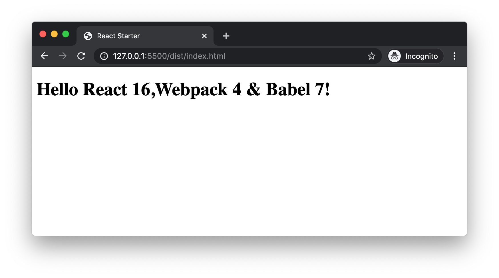

# Create React Starter App using React 16, Webpack 4 and Babel 7

In a typical React project, we use Babel and Webpack. Babel is used to convert JSX and ES6 to pure ES5 code. Webpack is used as the bundler. It will be helpful if we have a code base to start with any React project. That is what we are trying to do.

## Install Node.js and NPM

We need Node.js and NPM to download and install Node packages like React, Webpack and so on. We can download and install from their [official site](https://nodejs.org/en/). When we install Node.js, automatically NPM is also installed.

We can also install Node.js using [NVM](https://github.com/nvm-sh/nvm). If we use NVM, it is very easy to switch between multiple Node versions.

Once we complete Node.js and NPM installation, we can verify it by typing

```
> node --version
v12.14.1

> npm --version
6.13.4
```

## Create Project Folder

Let us create a new folder anywhere with name `react-starter`. In the terminal, navigate to the project folder.

### Package.json

In a Node project, `package.json` file stores the information about the project like its name, license, scripts, dependencies and so on. We can create a `package.json` file with default values using

```
npm init -y
```

`-y` flag is for setting default values. Now a `package.json` file is created inside the project folder with following contents.

```json
{
  "name": "react-starter",
  "version": "1.0.0",
  "description": "",
  "main": "index.js",
  "scripts": {
    "test": "echo \"Error: no test specified\" && exit 1"
  },
  "keywords": [],
  "author": "",
  "license": "ISC"
}
```

## Create Source

We structure our project folder in a way that all source files reside in one folder named `src`. Later, when we build our project, the deployable files will be generated and reside in `/dist` folder.

So, first create a folder `src` in the root. Now this folder will contain all the React component code written using JSX, styles written using SCSS and a template HTML to render the React components. When we build the project, all the JSX will be converted to JavaScript, all the SCSS will be converted to pure CSS, the HTML will be updated with needed file references and copied to `/dist` folder.

### Template HTML

As a starting point, let us create the `index.html` file inside `src` folder. This file is the template HTML.

```html
<!DOCTYPE html>
<html lang="en">
  <head>
    <meta charset="UTF-8" />
    <meta name="viewport" content="width=device-width, initial-scale=1.0" />
    <title>React Starter</title>
  </head>
  <body>
    <div id="root"></div>
  </body>
</html>
```

Few points about this `index.html` source file. The about-to-be created React component(s) will be rendered inside the `div` tag. Right now, we are not seeing any reference to any JavaScript or CSS files inside html. Those will be added in the generated html file during the build step. How? We will see later.

### React Component

We prepared the HTML to show our React component. It is time to create our React component. For that, create `index.js` file in `/src` folder. Paste following code.

```javascript
import React from "react";
import ReactDOM from "react-dom";

const App = () => {
  return <h1>Hello React 16,Webpack 4 & Babel 7!</h1>;
};

ReactDOM.render(<App />, document.getElementById("root"));
```

Let us understand what is happening above. We import `react` package to create our `App` component. We import `react-dom` package to render our component in the html.

> You might be thinking that, the `App` component is not using `React` anywhere to create the component. Then why adding the `React` import? It is because, when the JSX is converted to JavaScript, the code will have a line with `React.createElement` in it. At that time, this React dependency is required.

But, we have not added `react` and `react-dom` packages to our project. Let us do that now.

```
npm install react react-dom --save
```

Now we fulfilled all dependencies for `index.js` file.

## Webpack

So far our source codes are lying in `/src` folder. We do not have any files which can be deployed to server. What happens if we just copy both `index.html` and `index.js` to a web server like nginx or Apache? It simply renders the `index.html` in browser. Since there is no reference to `index.js`, it is ignored.

So we need someone to stitch both files and set it ready for deployment inside `/dist` folder. That someone is `Webpack`. Webpack is a bundler. In simple terms, we can say that Webpack wraps all dependencies of a project to a single bundle file and places it in the `/dist` folder.

Here is how we can install Webpack.

```
npm install --save-dev webpack
```

Once `webpack` package is installed, we need to give instructions to webpack on what to do. For that we need to create `webpack.config.js` file in the project root. Webpack always checks this file to understand how to bundle the project.

### Webpack Configuration

Create `webpack.config.js` file in project root. Paste the following contents.

```javascript
var path = require("path");

module.exports = {
  entry: "./src/index.js",
  output: {
    path: path.resolve(__dirname, "dist"),
    filename: "bundle.js",
  },
};
```

Now when webpack reads this config file, it understands that it needs to start creating the bundled file from the `index.js` file inside `src` folder. After creating the bundle, it needs to find `dist` folder and place the bundled file and name it `bundle.js`.

### Run webpack

Now its time to tell webpack to do the task as per the config file. For that, let us create a script in `package.json` file. Inside our current `package.json` file, we can see:

```json
"scripts": {
  "test": "echo \"Error: no test specified\" && exit 1"
}
```

We do not need the `test` command now. Instead replace that line with a `start` command which executes webpack. The scripts block looks like this:

```json
"scripts": {
  "start": "webpack"
}
```

Now to run the `start` script, go to project root folder in a terminal and type the following.

```
npm start
```

We expect our `bundle.js` file to be present in `/dist` folder. Instead, we are seeing an error in console.

```
One CLI for webpack must be installed.
...
You need to install 'webpack-cli' to use webpack via CLI.
```

What the error message says is, since we want to use webpack as a command line tool, we need to install `webpack-cli` also. For that, go to the terminal and type:

```
npm install webpack-cli --save-dev
```

After installing `webpack-cli`, let us try `npm start` command again.

When we run the command, webpack starts the bundling process. When it approached, `/src/index.js`, it found some characters which should not be found in a JavaScript file. So now `webpack` is throwing a different error in console.

```
Module parse failed: Unexpected token (5:9)
You may need an appropriate loader to handle this file type, currently no loaders are configured to process this file. See https://webpack.js.org/concepts#loaders
```

Now, this error has nothing to do with webpack. Basically, webpack is a bundler. It is trying to create a single bundle. On the way, it is not able to crunch the JSX syntax inside `index.js`. In order to understand and convert the JSX syntax to JavaScript, Babel is there to help.

## Babel

Babel is a transpiler, which means it can convert one type of code to a different type. In our project, we are using Babel to convert JSX to JavaScript.

Babel can stand alone and convert JSX to JavaScript. But, we have given the job to bundle the file to Webpack. So in order for webpack to use Babel to handle JSX files, Webpack requires `babel-loader`.

> Loaders are like different types of ammunitions collection of Webpack. Webpack might use a `babel-loader` to crunch a JSX file or ES6 file. Again, it might use a `sass-loader` to understand a SCSS file.

`babel-loader` just loads the Babel functionality to webpack. It does not have any other powers. So in order for `babel-loader` to work, we need to install the core babel package `@babel/core`. We also need to install `@babel/preset-env @babel/preset-react` to convert ES6 and JSX to ES5 respectively.

```
npm i @babel/core babel-loader @babel/preset-env @babel/preset-react --save-dev
```

Now, all the babel requirements are installed. But we have not told webpack to use `babel-loader` to parse a JavaScript file. Let us add that part in `webpack.config.js` file. Add the following code in the same level as that of `entry` key.

```json
module: {
  rules: [
    {
      test: /\.(js|jsx)$/,
      exclude: /node_modules/,
      use: {
        loader: "babel-loader"
      }
    }
  ]
}
```

Above code sets a rule in webpack config file. The rule is applicable for .js or .jsx files, excluding files in `node_modules` folder. Since this rule is present, whenever webpack needs to add a JavaScript file or JSX file to the bundle, it uses babel to transpile the code and then add the output to the bundle.

### .babelrc

Webpack calls babel using babel-loader. Babel needs to know what all capabilities it needs to have or in other words, what all presets needs to be defined. For that, we create a `.babelrc` file in the project root and add the following text.

```
{ "presets": ["@babel/preset-env", "@babel/preset-react"] }
```

Let us now go to the terminal and run `npm start`. This time, webpack successfully creates the `bundle.js` and place it inside `/dist` folder. We can see an output like below in console.

```
> webpack

Hash: 8e96f900f4a0ada759de
Version: webpack 4.41.6
Time: 7229ms
Built at: 02/18/2020 09:43:53
    Asset      Size  Chunks             Chunk Names
bundle.js  1.08 MiB    main  [emitted]  main
Entrypoint main = bundle.js
[./src/index.js] 255 bytes {main} [built]
    + 11 hidden modules
```

## HtmlWebpackPlugin

Our current state is we now have a `bundle.js` in `/dist` folder. There is no HTML file in `/dist` folder to be deployed. During the build process, we want Webpack to create a HTML file in `/dist` folder to serve the `bundle.js` file. `HtmlWebpackPlugin` is a webpack plugin who can help us here. Install it first using:

```
npm install --save-dev html-webpack-plugin
```

Once it is installed, we need to tell Webpack to use it. We need to modify `webpack.config.js` for the same. Please have a look in the code below to know the modifications to be done.

```javascript
var HtmlWebpackPlugin = require("html-webpack-plugin");
var path = require("path");

module.exports = {
  entry: "./src/index.js",
  //...
  module: {
    /*...*/
  },
  plugins: [
    new HtmlWebpackPlugin({
      template: "./src/index.html",
    }),
  ],
};
```

Here we added the `HtmlWebpackPlugin` to `plugins` array inside `webpack.config.js`. The plugin accepts a `template` option, where we can specify the source template html file, we have created.

Now when we run `npm start`, webpack creates both `bundle.js` and `index.html` inside `/dist` folder. The generated `index.html` file contains the reference to `bundle.js`.

We can open the `index.html` file in browser to see our React component rendered!



## WebpackDevServer

Our project is running fine. But during the development process, each time we need to run the webpack command and wait for the build to complete. Then open the html file in browser to see the output. This is time consuming.

Webpack has its own web server called `webpack-dev-server`. It automatically refreshes the browser with new change if any files are changed in source. First lets install `webpack-dev-server`.

```
npm i webpack-dev-server --save-dev
```

Now we can update the scripts in package.json file as follows.

```javascript
"scripts": {
  "start": "webpack-dev-server --open --hot",
  "build": "webpack"
}
```

In the `start` script, instead of building the project, we are directly serving the output in browser. `webpack-dev-server` can use webpack internally and store the bundle.js and index.html in the memory. Then serve the html file directly from the memory. It will not create a physical file in `/dist` folder.

`--open` flag is to open the default browser automatically. `--hot` is to set a watch for file changes and automatically reloads the browser when a change occurs.

Run `npm start` in the terminal.

We can see `webpack-dev-server` serving the output in a browser. We can go to `/src/index.js` and make any modifications in the React component. As soon as we save the file, the output in the browser gets updated. This is how `webpack-dev-server` makes development very easy.

## Summary

Now we have a code base to start trying any React project. This is just a starter. A lot can be improved before moving to actual production. Through this course, we learned that:

- We need **Node.js** and **NPM** to install and run packages used in our project.
- **package.json** file stores the project dependecies.
- We can create a simple and readable folder structure using `/src` and `/dist` to distinguish between our source files and deployable files.
- **Webpack** is a bundler which creates a single bundle file which contains all our project dependencies.
- All the configurations required for webpack is written in a `webpack.config.js` file in project root.
- In order to run `webpack` command in command line, we need to install `webpack-cli` package.
- **Babel** can be used with webpack using `babel-loader`.
- We specify the presets used by babel inside `.babelrc` file which is located at project root.
- **HtmlWebpackPlugin** is a webpack plugin which can dynamically create our deployable html file with reference to bundle.js file.
- During development process, we can make use of `WebpackDevServer` to serve our output file in a browser and automatically refresh the browser when a change in file occurs. This is called _hot-reloading_.
