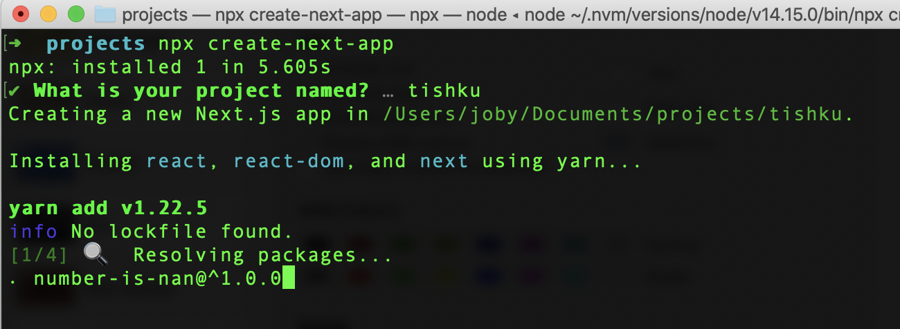
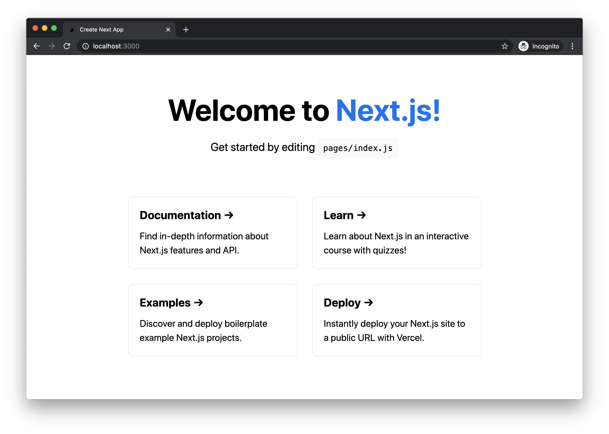

# Hello World Next.js Site for Beginners

Next.js is a popular framework built on top of React. It handles several functionalities required for a web app, like routing, server-side rendering, and APIs. Having said that, how easy is it to create a simple website using Next.js? Let us see in this article.

## Node Version

We need **Node.js** to run a Next.js website. In order to run a site with php files, we need a PHP engine in our server. Only that engine can execute `.php` files and respond back HTML to the user. Just like that, the Next.js framework executes JavaScript on the server. For that we need a JS engine which can parse and execute JavaScript on the server. And that is the role of Node.js.

We can check if Node.js is installed on our machine by typing the following command in the terminal.

```
node --version
```

If Node.js is installed, the above command prints the installed version number in the terminal, like `v14.15.0`. The version number should be greater than `v10.13.0` to run Next.js.

If we do not have Node.js, we can download it from [nodejs.org](https://nodejs.org) and install it.

> We can also install Node.js using [NVM](https://github.com/nvm-sh/nvm). It allows you to install multiple versions of Node.js on the same machine. Whenever required, it is very easy to switch between the versions.

## Project Setup

First we need to decide the directory in which we are going to store our Next.js project. I store all my projects under `Documents/projects`. I am using macOS. You can select any directory of your choice.

Next, navigate to that directory in the terminal.

```
cd ~/Documents/projects
```

> We do not have to create a folder for our Next.js project. That will be created in the following steps.

Staying in the chosen directory, execute the following command.

```
npx create-next-app
```

`npx` is a global command installed along with Node.js software. It helps to download and run a package in one step. Before `npx`, we had to install a package globally and then run it. In that case, we had to deal with permission-related issues. `npx` also ensures that the latest package is used while executing.

`create-next-app` is an interactive package. It will take the app name as input to configure and set up our Next.js project.



I gave the project name as `tishku`. Therefore, a folder `tishku` is created under the `projects` folder. The `tishku` folder contains a Next.js boilerplate code.

## Run the Application

Now our Next.js app is created. We can change to the project folder in the terminal.

```
cd tishku
```

Then we can run the application by executing

```
npm run dev
```

This command will run our Next.js application in development mode. By default, the app can be accessed at `http://localhost:3000`. When we open the link, it looks like this:



Awesome! We just set up and ran a Next.js app. The home page we are seeing is actually taken from `pages/index.js`. We can edit that file and play around.
