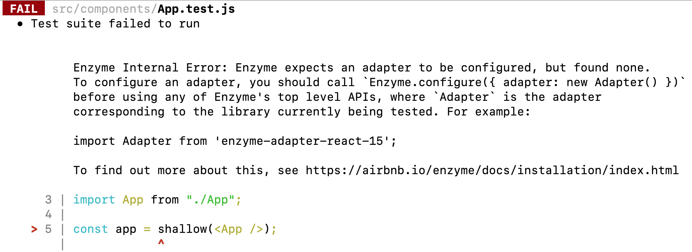

# SOLVED: setupTests.js not working in CreateReactApp

To use enzyme with React 16, I need to use an enzyme adapter. To setup the adapter before any Jest tests, I wrote the code in `src/setupTests.js`. For some reasons, that file is not being called by CreateReactApp. Instead, I am getting an error like this:

```
Enzyme Internal Error: Enzyme expects an adapter to be configured, but found none. To
configure an adapter, you should call `Enzyme.configure({ adapter: new Adapter() })`
before using any of Enzyme's top level APIs, where `Adapter` is the adapter
corresponding to the library currently being tested. For example:

          import Adapter from 'enzyme-adapter-react-15';
```



**Solution:**

I added a flag to `test` command in `package.json` file. So now my test command looks like:

```
react-scripts test --setupFiles ./src/setupTests.js
```

Then I ran `npm run test` again and it worked.
