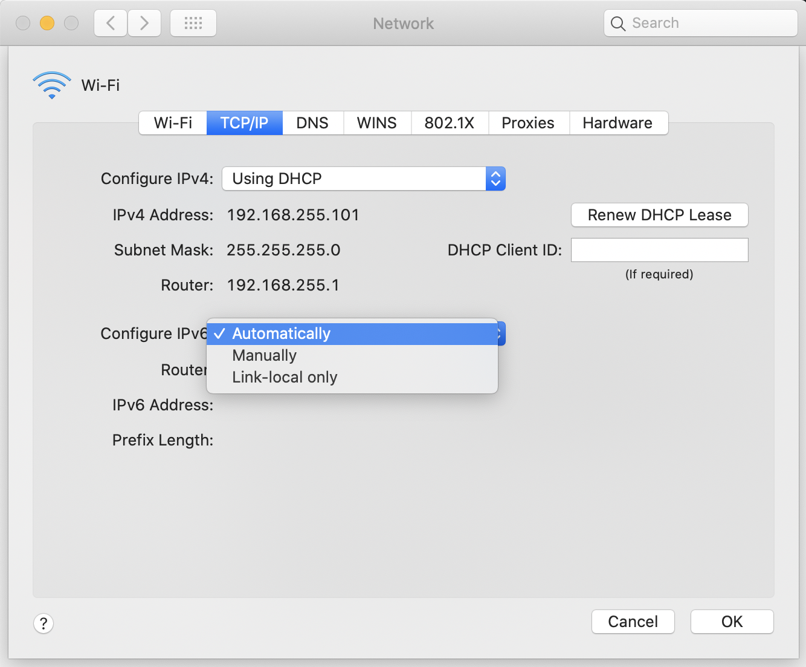
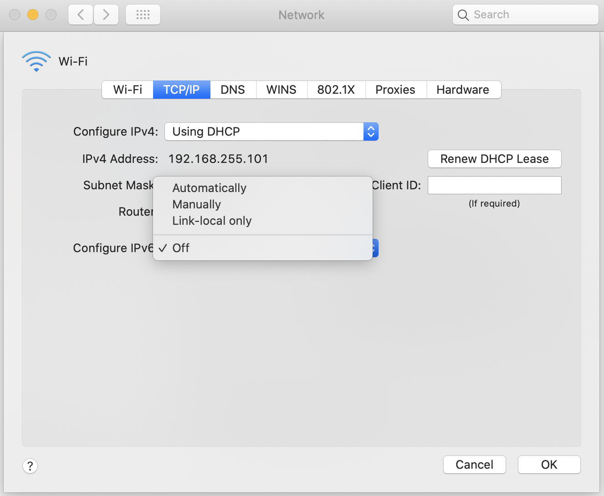

# SOLVED: MacOS - No Off Option Under Configure IPv6

Previous day, all of a sudden my client's development site was not accessible. I was getting a no access error page returned by CloudFlare. When checked with colleagues, IPv6 was the blocker in my MacBook. As a solution, I had to **turn OFF IPv6** on my Mac.

I took _System Preferences > Network_. There I clicked on _Advanced_ option of _Wi-Fi_. Then under _TCP/IP_, I could see _Configure IPv6_ option. The problem is, there was no _Off_ option.



## networksetup Command

Then the following solution worked for me. I opened the terminal and ran the following command.

```
networksetup -setv6off Wi-Fi
```

It turned OFF my IPv6 and then I could see the _Off_ option in the dropdown.


