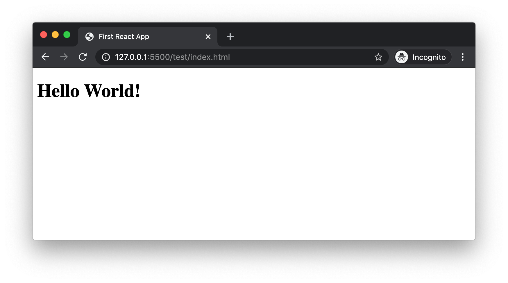
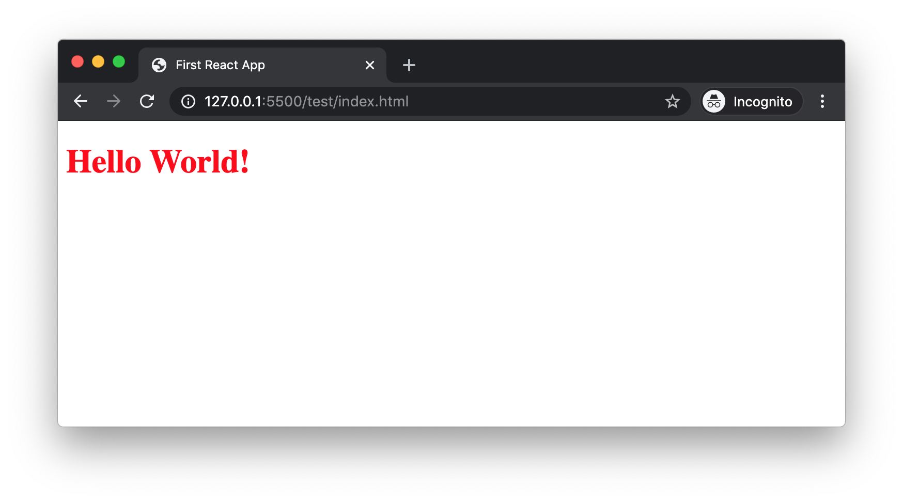

# Write Your First React App

You have heard about React and you are here to write your first React application. This is going to be just a _hello world_ application using React. We will learn a lot of related concepts through out.

## What is React for a 5 year old?

Have you seen websites with header, footer, sidebar? Have you seen Facebook with repeating blocks of statuses?
All these building blocks can be considered as different components collectively shape up a full website. React is a library to build such UI components.

## Trying React from CDN

Have you worked with jQuery? If yes, you know that it is as easy as adding a link to jQuery file and start using it. In similar lines, let us try to create a _Hello World_ component in React.

Create a HTML file, _index.html_. Place a `<div>` tag in the HTML file as a placeholder. Later, our Hello World React component will be rendered inside this `<div>`.

```html
<div id="root"></div>
```

The `id` value can be anything. Later we will use this `id` value to tell ReactDOM where to render our React component.

Next, add following CDN links to your HTML file.

```html
<head>
  <!-- .... -->
  <script
    crossorigin
    src="https://unpkg.com/react@16/umd/react.development.js"
  ></script>
  <script
    crossorigin
    src="https://unpkg.com/react-dom@16/umd/react-dom.development.js"
  ></script>
  <!-- .... -->
</head>
```

> CDN stands for Content Delivery Network. CDN providers have servers distributed across the globe. They cache our files(here react.development.js and react-dom.development.js) in all there servers. It helps any user from any geographical location to retrieve the file quickly.

First file we added is `react.development.js`. It is for react development. It contains more debugging information and comments. Therefore, the file size will be larger compared to its production version. Now in the React world, this `react.js` or `react.development.js` contains all the code to **create** components.

We now need someone to render the created components to web browser. For that we import `react-dom.development.js`. This file contains code to efficiently render React components on screen.

Now our HTML setup is done. Let us write our _Hello World_ component in a separate JavaScript file(`component.js`). Add the reference of the new file inside our HTML. Our final HTML file looks like this:

```html
<!DOCTYPE html>
<html lang="en">
  <head>
    <meta charset="UTF-8" />
    <meta name="viewport" content="width=device-width, initial-scale=1.0" />
    <meta http-equiv="X-UA-Compatible" content="ie=edge" />
    <title>First React App</title>
    <script
      crossorigin
      src="https://unpkg.com/react@16/umd/react.development.js"
    ></script>
    <script
      crossorigin
      src="https://unpkg.com/react-dom@16/umd/react-dom.development.js"
    ></script>
  </head>
  <body>
    <div id="root"></div>
    <script src="component.js"></script>
  </body>
</html>
```

When we add reference to `react.development.js`, it adds an object `React` to global scope. The `React` object contains a method called `createElement()`. This method is used to create a component in React.

In _component.js_, first we will create a component and assign it to a variable `myComponent`.

```javascript
const MyComponent = React.createElement("h1", null, "Hello World!");
```

`createElement()` method accepts 3 arguments. First argument is the HTML tag name. Second attribute is the properties or attributes for the HTML tag. Third argument is the children. The child of an element can be a string or another React component.

Now our component is ready. But we need to render it inside the `div#root` element. For that, _react-dom.development.js_ file loaded by CDN adds a `ReactDOM` object to global scope. We can use `render()` method inside `ReactDOM` object to render `MyComponent` to browser.

```javascript
ReactDOM.render(MyComponent, document.getElementById("root"));
```

Here is the full code for _component.js_.

```javascript
const MyComponent = React.createElement("h1", null, "Hello World!");

ReactDOM.render(MyComponent, document.getElementById("root"));
```

Our _component.js_ file is done. Now, let us open _index.html_ in browser. It will render our React component inside the div.



> Here the HTML code that is rendered as part React component is written using React. That says that, HTML is being rendered by JavaScript. So, when using React, we do not have to render all HTML code to browser and programatically hide whichever not needed. Instead, we can do the condition check in JavaScript and render only the needed HTML code to browser DOM.

In the parameter list of `React.createElement()`, second argument passed was `null`. Let us add an object instead of `null`.

```javascript
const MyComponent = React.createElement(
  "h1",
  { style: { color: "red" } },
  "Hello World!",
);
```

Now a `style` attribute is added to the `h1` tag.



So now we successfully created a React component and used it in our web page. But as we can see in `React.createElement()`, the syntax used to show a simple `h1` tag is quite twisted. When the amount of HTML is more, things can get worse. For example, consider the HTML below.

```html
<div>
  <h1>Blog Title</h1>
  <p>Here is the blog description.</p>
</div>
```

When we convert the code to equivalent React code, it looks like below.

```javascript
const MyComponent = React.createElement("div", null, [
  React.createElement("h1", null, "Blog Title"),
  React.createElement("p", null, "Here is the blog description."),
]);
```

To make the life of developers easy, Facebook came up with a special syntax called **JSX**(JavaScript Syntax eXtension). Instead of writing difficult `React.createElement()` code, it helps to work with HTML kind of syntax. For example, the above component can be written like below in JSX.

```javascript
const MyComponent = (
  <div>
    <h1>Blog Title</h1>
    <p>Here is the blog description.</p>
  </div>
);
```

More on JSX in the next section.

## Creating React Components using JSX

As we saw earlier, if we are using JSX syntax, it is very easy to work with. But, there is a problem. Browsers can download JavaScript files and execute it using their JavaScript engine. JavaScript engines cannot understand JSX.

So, let the developers like us work with JSX. We can use a tool to convert our JSX work to pure JavaScript. That tool is **Babel**.

Let us rename our _component.js_ file to _component.jsx_. That is just for code readability. Now any other developer can know that this file contains JSX code. Here is the full code in _component.jsx_.

```javascript
const MyComponent = (
  <div>
    <h1>Blog Title</h1>
    <p>Here is the blog description.</p>
  </div>
);

ReactDOM.render(MyComponent, document.getElementById("root"));
```

### Install Node.js

Node.js is a server-side runtime environment for JavaScript. That means Node.js has got an engine which can read and execute JavaScript. You can install it from [Node.js official site](https://nodejs.org/en/download/).

You can verify Node.js installation by typing following command in terminal.

```
node --version
```

It will display the version number. Mine is _v12.14.1_. We need Node.js to run some build tools like Babel.

When installing Node.js, it also installs NPM(Node Package Manager). It is a rich repository of many packages. You can check for npm installation by typing following command in terminal.

```
npm --version
```

My NPM version number is _v6.13.4_. We download and install required tools from NPM repository.

### Install Babel

Babel is a transpiler. It means it can convert one type of code to another type. Eg: Babel can convert ES6 code to ES5. Babel can also convert JSX code to React.js code.

We now need Babel to convert `component.jsx` to `component.js` file. To use `babel` command in terminal, we need to install Babel globally. Run this command in terminal.

```
sudo npm install -g babel-cli
```

`-g` command is used to install any package globally. Only if a command is installed globally, we can use `babel` as a command in terminal. We can test if Babel is installed successfully by typing following command in terminal.

```
babel --version
```

In my machine, I have already installed v7.4.3 sometime back.

Now `babel-cli` is like a robot. But it does not have knowledge to convert JSX to JavaScript. We need to teach Babel how to do that. This is by installing `@babel/preset-react` package. If `babel-cli` was installed globally, `@babel/preset-react` is installed within the project boundary.

Before installing `@babel/preset-react`, we need to create a file in our project with name _package.json_. This file maintains the package dependencies of our project. `npm` has an `init` command to create _package.json_ file. In the terminal, from the root of our project, run below command.

```
npm init -y
```

`-y` is to accept all the default values while creating the _package.json_ file. Now the file is created with default content that looks like this.

```javascript
{
  "name": "test",
  "version": "1.0.0",
  "description": "",
  "main": "index.js",
  "scripts": {
    "test": "echo \"Error: no test specified\" && exit 1"
  },
  "keywords": [],
  "author": "",
  "license": "ISC"
}
```

Now we can start with `@babel/preset-react` package installation. In the command prompt, type:

```
npm install --save-dev @babel/preset-react
```

### Transpiling JSX to JS

From the root project folder in terminal, run this command.

```
babel --presets @babel/preset-react component.jsx -o component.js
```

Here we are telling `babel` to use `@babel/preset-react` to convert _component.jsx_ to _component.js_. If we open the _component.js_ file, we can see the transpiled pure JavaScript code.

If we open the _index.html_ in a browser, we can see the output.


Now we saw how to create a React component using JSX. Our project is a very simple one as of now with only one component file. That is why it is ok to go to terminal and run babel command everytime. But as the project grows bigger, we need to automize some tasks. That part we will discuss in a separate article.

## Summary

React.js is a UI component library. We can write React components using pure JavaScript. But, that can be of huge effort. JSX syntax helps to write React components in HTML kind of syntax. Browsers cannot understand JSX. So we use a transpiler like Babel to convert JSX to pure JavaScript code.
