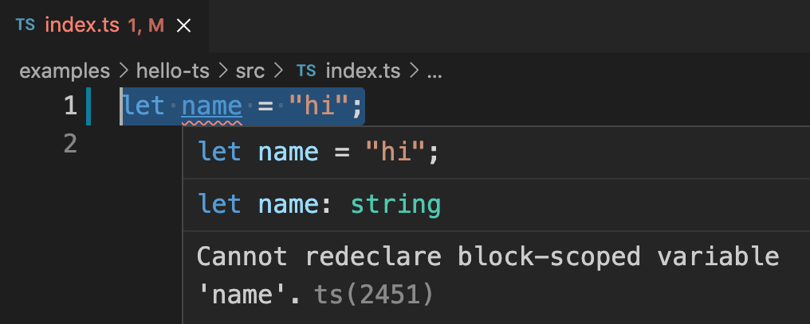

# SOLVED: TypeScript Cannot Redeclare Block Scoped Variable Name

If you are facing this issue with `name` variable or some other variable, this article can help. In order to recreate this issue, just create a new TypeScript file and add the following line to it.

```typescript
let name = "hi";
```

If we are using VSCode, we can see the error immediately as shown below.



## Reason For Error

The error is coming due to a TypeScript feature. When we write a code in TypeScript in a new file, it needs to follow either of below conditions.

- File needs to be declared as a _module_ with its own scope
- File has been declared as a _script_ that shares global scope

Our file followed the second condition. In that case, variable `name` is already in global scope because the global object has a property named `name`. Along with that, `let` does not allow redeclaration. Both these combined, threw the error.

## How To Solve

We need to tell TypeScript that our file is a module with its own scope. TypeScript considers any file with `import` or `export` statements as a module. Just to notify TypeScript that our file is a module, add the following line as the first line of TypeScript file.

```typescript
export {};
```

Yes, adding that one line will solve the problem. So our final TypeScript file looks like below.

```typescript
export {};

let name = "hi";
```
