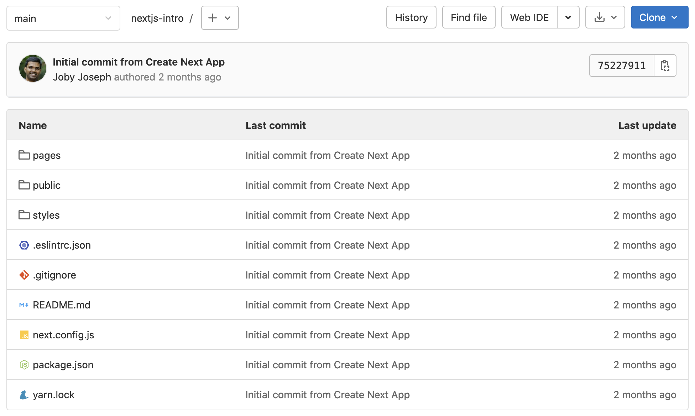
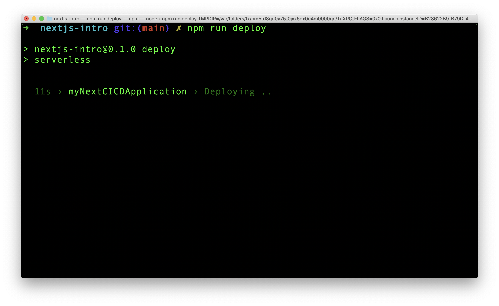
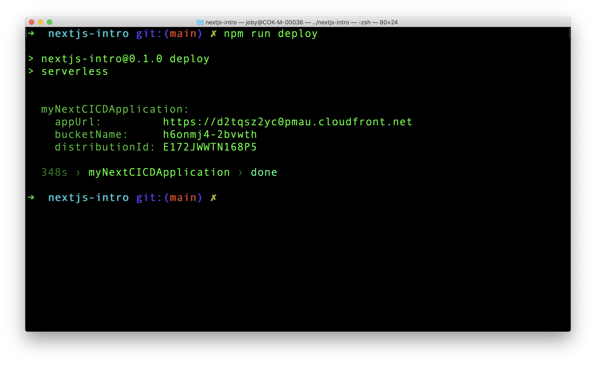
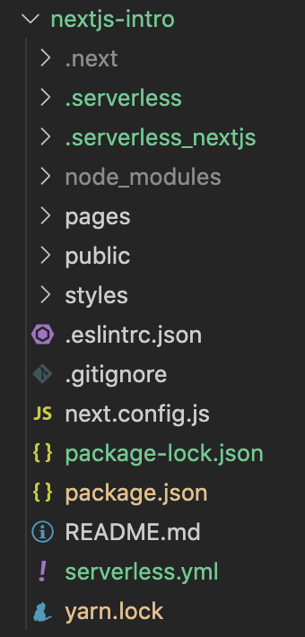
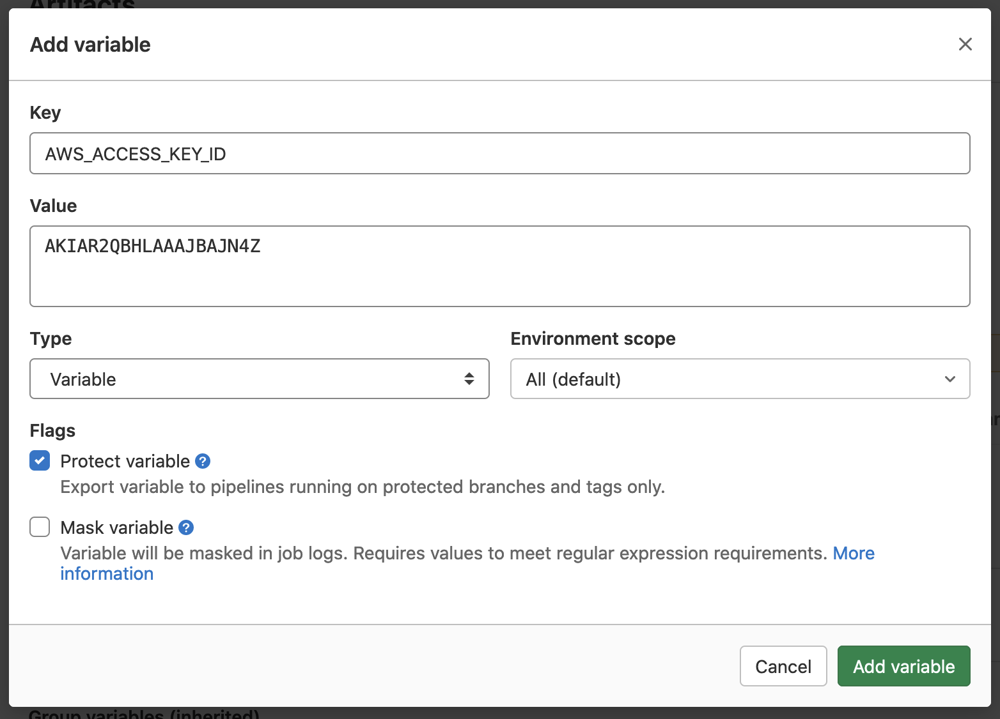
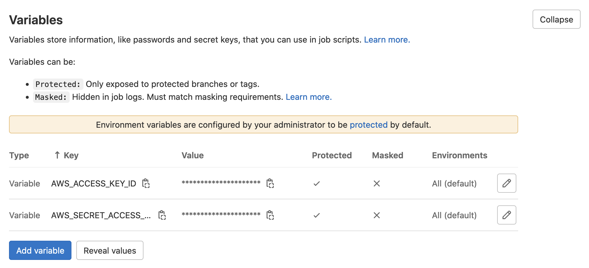
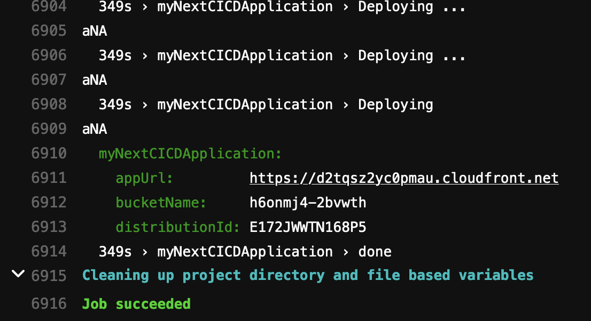

**Next.js** is a **React framework** that helps us to build **isomorphic web applications** easily. Isomorphic applications are those web applications which can be rendered either in the client side or in the server side. In a real world project, building an application and deploying it to server should be automized using any CI/CD tool. In this article, we will perform following steps.

1. Save and version a Next.js application in Gitlab repository
2. Setup a Gitlab CI/CD pipeline that deploys the application to AWS Lambda

Here, Gitlab is the Git server. It can be different for you like Bitbucket, Github and so on. Also, the CI/CD used is also from Gitlab. For other CI/CD tools, the syntax will be different but the base algorithm will be same.

## Project Setup

First step in our process is to setup a Next.js application. For that you need to have Node.js installed in your machine. After that run following command in terminal.

```
npx create-next-app@latest
```

Above command asks for a project name. It then creates a folder with that name and then setup your Next.js application in that folder. If you have difficulty in setting up a Next.js application, you can also refer to this [article](https://backbencher.dev/articles/hosting-nextjs-aws-lambda-serverless). Refer to _Create Next.js Application_ section.

Next, create a repository in Gitlab and push the current code to the repo. My repository name is _Next.js Intro_.



The Gitlab repo looks like above.

## Serverless

Serverless is a NPM package using which we can upload our Next.js application to AWS Lambda. To install that, go to our Next.js app root folder and run below command.

```
npm install --save serverless
```

Now `serverless` package is added to our Next.js project. The package name is also appended to `dependencies` section in `package.json` file. Next, we need to create a new command in `package.json` to invoke our serverless package. For that, open `package.json` file of our Next.js application. Under `"scripts"` section, add below key-value pair.

```
"deploy": "serverless"
```

By adding above command, we can run `npm run deploy` in terminal to invoke `serverless`. When `serverless` command runs, it executes the set of tasks written in `serverless.yml` file. Right now, we do not have that file in our project. So, create a `serverless.yml` in the project root folder.

In the yml file, add the following content:

```
myNextCICDApplication:
  component: "@sls-next/serverless-component@latest"
```

The `@sls-next/serverless-component` is written exclusively for Next.js. By adding the reference to it in serverless.yml file, `serverless` now know the steps to deploy our Next.js application to **AWS Lambda@edge**.

Ok, now serverless is ready to upload our Next.js application to AWS. But which AWS account? For that, we need to set two environment variables, `AWS_ACCESS_KEY_ID` and `AWS_SECRET_ACCESS_KEY`.

### Testing Serverless

First take terminal. Navigate to the folder of our application. If you are using a Mac machine, run following commands to set environment variables.

```
export AWS_ACCESS_KEY_ID=<your access key id here>
export AWS_SECRET_ACCESS_KEY=<your secret access key here>
```

You can confirm if the environment variable is properly set by running `printenv` in Mac. For other OS, the command might be different.

After setting environment variables, run `npm run deploy` in terminal. That will execute our `serverless` command. We can see the deploying process.



Once the deployment is complete, the serverless component, gives the AWS cloudfront url to access our site.



Push the new changes to the project repo in Gitlab. The main changes are related to `serverless` package. Just to ensure that we are in sync, our project structure now looks like this.



Now, its time to tell Gitlab CI/CD to handle the build and deployment. Gitlab has all necessary files to do that in the repository.

## Gitlab CI/CD

First we need to be clear about the expectation from Gitlab CI/CD. Here is the flow of process:

- We push any changes to our app to the `main` branch
- Gitlab CI/CD recognizes the change and start building the project
- After building, Gitlab CI/CD redeploys our application to AWS Lambda with the help of serverless framework
- We can see our changes reflected in the cloudfront url

Just like `serverless` is expecting a `serverless.yml` file, Gitlab CI/CD expects a `.gitlab-ci.yml` file in our project. A software called Gitlab Runner is the one who listens for change and execute the jobs defined in the yml file. We are going to implement the steps mentioned above in this `yml` file.

To start with, create `.gitlab-ci.yml` file in the project root.

In order to run our project, we need a Node.js environment. We can use a Docker image here using `image` property.

```
default:
  image: node:16.13.1
```

In Gitlab CI/CD yml file, we can define different **jobs**. A job contains a set of scripts to be executed. There are ways to run multiple jobs serially or parallely. Let us create a job in our yml file.

```
stages:
  - deploy

aws-deploy-job:
  stage: deploy
  script:
    - npm install
    - npm run deploy
```

Before all jobs, we define **stages**. In our code, there is only one stage, `deploy`. There can be multiple stages. `aws-deploy-job` is a job name. That job is connected to `deploy` stage. All the commands under `scripts` are executed when this job is running.

### Setup Environment Variables

When Gitlab runs our script, the serverless framework in our project will search for AWS credentials. It is there in our local machine, but not in Gitlab. We cannot directly and openly paste AWS credentials in `.gitlab-ci.yml` file. That causes security breach. Instead, there is an option to define variables and their values in Gitlab console. This console can only be accessed by authorized users.

Let us set two variables in the console for AWS access key ID and AWS secret access key. For that, Go to Repo **Settings** > **CI/CD** > **Variables** section. Expand the section and add a new variable like below.



In similar manner, add another variable for Access Secret. Here is how the Variables sections looks finally.



We created two variables required for serverless Component. Since we did not change anything in the code, there is nothing to push to Gitlab. Instead, Go to Gitlab CI/CD pipeline and rerun the last failed pipeline. That will install all dependencies for the project using `npm install` and after that, run serverless.



Now, when serverless is run by Gitlab CI/CD it has the needed AWS credentials from the environment variables. From now on, if we push any changes to our Gitlab repo, automatically the pipeline will run and deploy the updated site to AWS Lambda@edge.

## Summary

We learned how to setup CI/CD pipeline for deploying our Next.js site to AWS Lambda. Now the pipeline is not production ready. Ideally, we setup different branches that maps to different environments(dev, qa, stage, prod). After that, when we push code to dev branch, deployment to dev environment happens, qa to qa environment and so on. We need to do update Gitlab yml file to manage our project like that.
