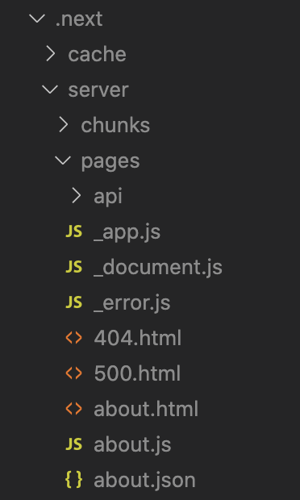

Next.js can create **static HTML pages** at build time. Static HTML pages can then be deployed in **CDNs** to improve page performance. Using `next export` command, we can create a static HTML site from a Next.js site.

Even without using `next export`, Next.js does **automatic static optimization** by generating HTML files for pages. If a page contains `getServerSideProps` or `getInitialProps`, Next.js will switch to render the page **on-demand** or **per-request** (meaning Server-Side Rendering). If both `getServerSideProps` and `getInitialProps` are NOT present, Next.js automatically create a static HTML file.

In my Next.js project, I created a new page for `about`. It contains following code.

```javascript
export async function getStaticProps(context) {
  return {
    props: {
      name: "Joby",
      age: 35,
    },
  };
}

export default function About({ name, age }) {
  return (
    <div>
      <h1>About Page</h1>
      <span>
        {name} is {age} years old
      </span>
    </div>
  );
}
```

As you can see, in the above code `getServerSideProps` and `getInitialProps` are not present. Now when I run `next build`, I could see `about.html` generated under `.next/server/pages/`.



If there is `getServerSideProps` in the page, then, instead of `about.html`, Next.js creates `about.js`. The `about.js` is then executed in a node server like a normal Node.js application.
