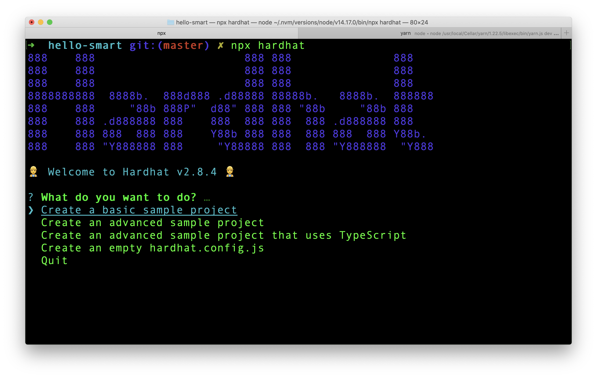
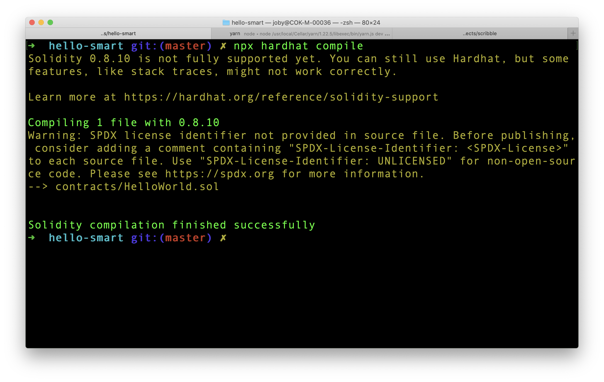

Smart Contracts are programs stored on a blockchain that run when predetermined conditions are met. We are going to create our first smart contract.

Create a new folder and navigate to it.

```
mkdir hello-smart
cd hello-smart
```

Initialize **Git** to convert the folder to a git repository. Then initialize **Yarn** to convert the project to a node package. You can also use npm also, instead of yarn.

```
git init
yarn init -y
```

The skeleton is ready. Open the folder in a code editor. I am using Visual Studio Code. In the editor, create `.gitignore` file and add just one line to it.

```
node_modules
```

This will prevent Git from pushing `node_modules` folder to Git server.

## Hardhat

[Hardhat](https://www.npmjs.com/package/hardhat) is an Ethereum development environment for us. It is a tool for building and deploying contracts to any Ethereum network. It facilitates frequent tasks like running tests, auto check code for any errors.

Add `hardhat` as a dev dependency to the project.

```
yarn add -D hardhat
```

Even though we installed hardhat in our project, we are going to run through hardhat steps using `npx` command.

```
npx hardhat
```

We are presented with the first question to start a hardhat project.



Select the 4th option from the list which is _Create an empty hardhat.config.js_ and press Enter. A new file `hardhat.config.js` will be created in our project.

## Folder Structure

The typical folder structure for a smart contract looks like this:

```
project
    - contracts
        - mycontract.sol
        ...
    - scripts
        - deploy.ts
        ...
    - test
        - mytest.js
        ...
```

We store all our code for contracts under `contracts` folder. Files under `scripts` folder are used for deploying the contract. `test` folder contains test code.

Hardhat automatically takes code from `contracts` folder and compile each code. Also, when we run hardhat test command, it goes through `test` folder and run each tests.

## First Contract

Create a file under `contracts` folder and name it `HelloWorld.sol`. `.sol` file extension is for **solidity**, which is the programming language of Ethereum. Lets start filling the file.

First step is to tell Solidity, what compiler we expect.

```solidity
pragma solidity ^0.8.0;
```

`pragma` is kind of pre-compilation level. It says that we need atleast `0.8.0` compiler level for compilation. You can imagine above line as `package.json` in node projects which tells what versions of tools to be used.

Next add following to the file.

```solidity
contract HelloWorld {

}
```

The contract syntax looks similar to a class. In lot of ways it has similarities to a class. Contract is a **state container** with functions that can mutate the state. Contract also has a **constructor**. This constructor will be executed **only once** when deployed to a network.

Now add the below function inside `HelloWorld` contract.

```solidity
function hello() public pure returns (string memory) {
    return "Hello World";
}
```

As we can guess this is a normal function that is public and returns a string `"Hello World"`. `pure` represents that this function does not read or update the contract state. As we can see, our `hello()` simply returns a hard coded string. So it is a pure function.

Here is the complete contents of `HelloWorld.sol`.

```solidity
pragma solidity ^0.8.0;

contract HelloWorld {
    function hello() public pure returns (string memory) {
        return "Hello World";
    }
}
```

## Compilation

Before compilation step, we need to verify that the compiler version in `hardhat.config.js` and what is requested in our solidity file matches. In our case, the compiler version in `hardhat.config.js` is `0.7.3`. We need to update the version to `0.8.10` in hardhat config file. Then only it matches the version number in `HelloWorld.sol` file.

After making version changes, go to terminal and run:

```
npx hardhat compile
```

The contract should compile successfully.



Hardhat stores the compiled contract under `artifacts` folder which was dynamically created during compilation. If we open `artifacts/contracts/HelloWorld.sol/HelloWorld.json`, we can see all the information about our contract and also the bytecode which is required for Ethereum Virtual Machine.

After compilation, the next step is to deploy the contract to a test network. We will cover that part in the next article.
