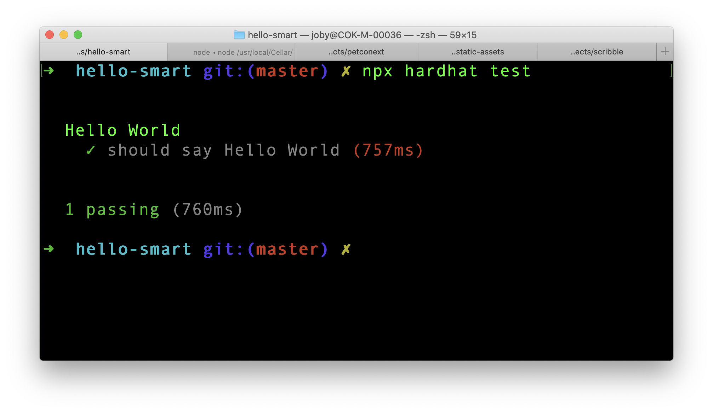

In the previous article, [How To Create Your First Smart Contract](/blog/how-to-create-first-smart-contract), we created our first smart contract. Next step is to test it.

## Setup Test Environment

We need to install few dependencies to setup our test environment.

```
yarn add -D @nomiclabs/hardhat-ethers ethers chai
```

@nomiclabs creates npm packages that makes working with **hardhat** much easier. It adds more capabilities and functions to easily work with hardhat.

`@nomiclabs/hardhat-ethers` is a hardhat plugin for integration with `ether.js`. Ether.js helps us to interact with Ethereum blockchain in a simple way.

`ethers` is a node package that contains complete Ethereum wallet implementation and utilities in JavaScript and TypeScript.

Next we need to install **TypeScript** dependency.

```
yarn add --save-dev ts-node typescript
```

Lastly, we need to install the test assertion library `chai` and related types.

```
yarn add --save-dev chai @types/node @types/mocha @types/chai
```

Now that we have installed everything to run TypeScript. So we need to change the file name of `hardhat.config.js` to `hardhat.config.ts`.

Next, open `hardhat.config.ts` file and add following import statements for ether package.

```typescript
import "@nomiclabs/hardhat-ethers";
```

Now everything is done to write our tests in TypeScript.

## First Test

In the previous [article](/blog/how-to-create-first-smart-contract), we created 3 folders `contracts`, `scripts` and `test` to store related files. We need to now create a test file `HelloWorld.ts` inside `test` folder.

First we need to import required packages to run the test. So add below lines to `HelloWorld.ts` file.

```typescript
import "@nomiclabs/hardhat-ethers";
import { ethers } from "hardhat";
import { expect } from "chai";
```

Next we use `describe` and `it` functions from `mocha` to write our test.

```typescript
describe("Hello World", () => {
  it("should say Hello World", async () => {
    // Test code here
  });
});
```

`describe` is used to structure and group tests in mocha. `it` creates tests. Now, inside the `it` callback function, add below 4 lines.

```typescript
const HelloWorld = await ethers.getContractFactory("HelloWorld");
const hello = await HelloWorld.deploy();
await hello.deployed();

expect(await hello.hello()).to.equal("Hello World!");
```

First line picks the `HelloWorld` contract which we created in the [previous article](/blog/how-to-create-first-smart-contract).

Second line deploys the contract to a network. In this case, the network is a test network spin up by hardhat and is dissolved immediately after the test. Everything is managed by hardhat.

Third line, `await hello.deployed()` makes sure that the contract is deployed. When we work with Ethereum, deployment will not happen instantly. This line waits to ensure that deployment is success.

Fourth line invokes the contract function and tests for the value returned.

## Run Test

In order to run our test, go to the project folder in terminal and run:

```
npx hardhat test
```

Sometimes, you may get below error:

```
Error HH13: Your Hardhat project uses typescript, but ts-node is not installed.
```

In that case, install `ts-node` again.

```
yarn add -D ts-node
```

Then run `npx hardhat test` again. If everything went well, we should see the test passing successfully.



We successfully created a test suite for our smart contract and executed it. In the next part, we will go through the deployment process.
