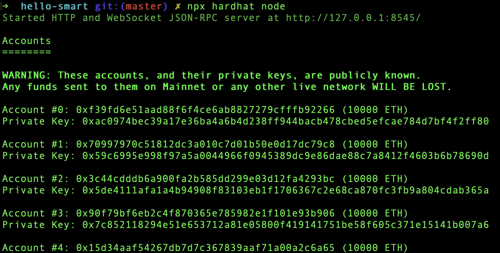

In the previous two articles, we learned how to create and test a smart contract. In this article we focus on deploying a smart contract to a real network. Here are the links to previous two articles.

1. [How To Create Your First Smart Contract](/blog/how-to-create-first-smart-contract)
2. [Testing Smart Contract Using Hardhat](/blog/testing-smart-contract-hardhat)

You need to go through above two articles to better understand this article.

## Deploy Script

When we say **real** network, there are networks like [Darwinia](https://darwinia.network/) or [Mainnet](https://ethereum.org/en/glossary/#mainnet). But these networks are paid and we are not going to use them now. We can spin up real network in our laptop itself as a **localhost** network. We will see how to do that soon.

Now, under `scripts` folder, create a new file `deploy.ts`. The file name can be anything. What we are going to do next is very similar to what we did in contract testing.

First, add package references to the file.

```typescript
import "@nomiclabs/hardhat-ethers";
import { ethers } from "hardhat";
```

Next, we add a function that can deploy a contract to a network.

```typescript
const deploy = async () => {
  const HelloWorld = await ethers.getContractFactory("HelloWorld");
  const hello = await HelloWorld.deploy();
  await hello.deployed();

  return hello;
};
```

`deploy()` function creates a contract `hello` and returns the contract once it is deployed in network.

We now create a handler function `sayHello()` that can take a contract and invoke it.

```typescript
const sayHello = async (contract) => {
  console.log(await contract.hello());
};
```

Next, we call both `deploy()` and `sayHello()` functions.

```typescript
deploy().then(sayHello);
```

## Run Deploy Script

In order to run the deploy script, we need to first go to the terminal and navigate to our project folder. There, execute following command.

```
npx hardhat run scripts/deploy.ts --network localhost
```

Instead of `deploy.ts`, you need to substitute with the file name you have given. Above command tells to do the deployment in local network. For that there has to be a local network on the first hand.

If you are running above command for the first time, you will receive an error message saying:

```
(node:30727) UnhandledPromiseRejectionWarning: HardhatError: HH108: Cannot connect to the network localhost.
```

This is because in order to deploy to a network, first the network nodes should be present in localhost. For that run below code to create nodes in a **new tab**. We run it in a new tab, because the process will be running without giving back the command prompt.

```
npx hardhat node
```

Now the local network is up and running. It creates 20 nodes by default as shown below.



After the nodes are up, rerun deploy script. We should see the `Hello World!` text printed by `sayHello()` function.


Now we learned how to deploy a smart contract to a network. When it comes to production environment, the `--network` will be substituted by real networks.
