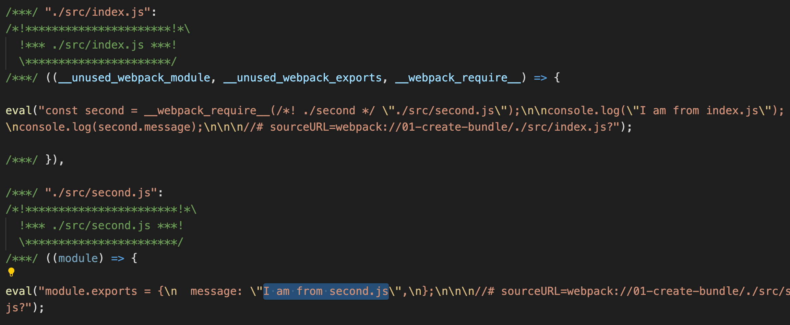
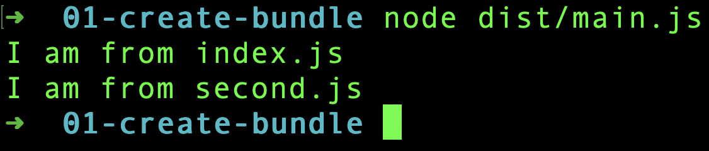

Webpack is a **static module bundler** for JavaScript. Webpack finds out the required JavaScript files and its dependencies. Later, it creates a **single** or **multiple** bundle files to be used in production.

Let us directly dive into how a bundle is formed. Create a folder anywhere to try webpack. Then initialize the folder as a NPM package using:

```
yarn init -y
```

We need to install `webpack` and `webpack-cli` packages.

```
yarn add webpack webpack-cli
```

At the time of writing, Webpack version is `5.70.0`.

Next, in `package.json` we add a script command to run webpack.

```javascript
"scripts": {
    "build": "webpack --mode=development"
}
```

We are running webpack in `development` mode. By default, webpack builds the project in `production` mode. In production mode, the bundle file generated will be minified and uglified. We prefer development mode now to better understand what is happening behind the screens.

## Source files

We need two JavaScript files to try webpack. First, create a file `index.js` under `<project_folder>/src` and add following content.

```javascript
// /src/index.js

const second = require("./second");

console.log("I am from index.js");
console.log(second.message);
```

As we can see, `index.js` is using an object from `second.js`. So create `second.js` file in the same level as that of `index.js` and add the following content.

```javascript
// /src/second.js

module.exports = {
  message: "I am from second.js",
};
```

We are done with our coding part.

## Running Webpack

We already have a script command in `package.json` to run webpack. So, go to terminal and run:

```
yarn build
```

It creates a new folder `/dist` and the folder contains a `main.js` file. This `main.js` is the bundle file generated by webpack.

If we open `main.js` file, we can see some complex JavaScript. We do not have to worry about that. It is the way how Webpack bundles. Now, if we search for contents from our `index.js` and `second.js`, we can find it in `main.js`.



So does main.js contains all the logic to execute independently? Let us test that. Go to terminal and directly run the `main.js` using node.

```
node dist/main.js
```

We can see the console outputs in the terminal.



## Tree Shaking

We did not write any instructions to webpack about our file structure. Still, webpack first took the `index.js` file under `src` folder, resolved dependencies of `index.js` and finally created a bundle file(`main.js`) in `dist` folder. This all worked because we wrote everything as per webpack's default configuration.

From webpack 4 onwards, we do not need to supply explicit configuration file. There are some default configuration. Taking the file from `/src/index.js` as the starting point is part of the default configuration.

Also, writing the output bundle file as `main.js` inside `dist` folder is part of default configuration.

So webpack, like a detective entering a house, enters into our project through `index.js`. It then climbs to `second.js` after seeing the `require()` statement. Like that, it crawls through the entire project and creates the bundle. This crawling process is also termed as `Tree Shaking`, where the unused code is eliminated.

Hope you got a basic idea about Webpack and its working.
