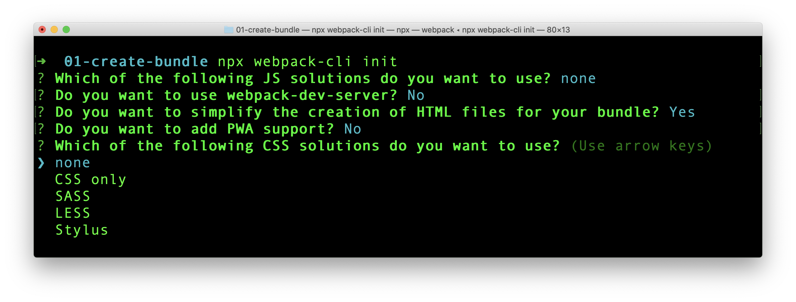

If we are using Webpack to bundle assets in our project, we can supply a set of options to webpack. This can be done either through command line or creating a `webpack.config.js` file.

From Webpack 4 onwards, it is not mandatory to supply a configuration file. Webpack takes, its own default configuration if none is provided. Default configuration expects the entry point to be `src/index.js` and bundle destination to be `dist/main.js`.

## webpack.config.js

If a file with name `webpack.config.js` is present in the project, when webpack is executed, it respects the options present in that file.

Here is a sample config file:

```javascript
module.exports = {
  mode: "development",
  entry: "./src/app.js",
};
```

The config JavaScript file is a **CommonJS module**. An object is exported from this file which is then considered by Webpack. Above configuration tells following things to webpack while it is running:

- Build the project in `development` mode. So the output bundle file will contain comments and non-minimized code. Default project mode is `production`.
- The entry point of webpack is set to be `app.js` under `src` folder. From there, webpack starts creating the dependency graph. Default entry point is `src/index.js`.

## Using Different Config File

By default, Webpack takes configuration details from `webpack.config.js`. If for some reasons, we need to tell webpack, to take different file as the configuration file, we can use `--config` flag.

If our new webpack configuration file is named as `production.config.js`, we can make use of it by running webpack as shown below.

```
webpack --config production.config.js
```

## Config Generation Tool

Webpack can help us to generate a config file using `webpack-cli` tool. To generate the file, we can go to the project root in terminal and run:

```
npx webpack-cli init
```

> Befor running above command, we need `@webpack-cli/generators` in our project. If it is not present, install it using `npm` or `yarn`.

When running above command, webpack will ask a set of questions. The process is interactive.



The process will create a boilerplate code with `package.json`, `index.js` and `webpack.config.js` file. If those files are already created in the project, there is option to overwrite or keep them.

## Playground

[Createapp.dev](https://createapp.dev/) is a very interactive online application that gives us the configuration required for different project types. Give it a try.
