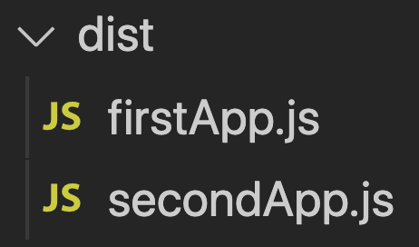

Webpack is like a secret agent who enters into a building through the main door and then go deep inside through inner doors. Once the agent comes out, he has all the links in his head as a **dependency graph**. Based on that graph, he creates a **bundle file**.

We can configure how Webpack works by passing a set of predefined options. One such option is `entry`. The `entry` option tells webpack, which module to start with to generate the dependency graph.

> The default value of `entry` is `./src/index.js`.

We can pass the entry option to webpack in multiple ways.

## Single Entry Syntax

If we want webpack to start bundling from `./src/app.js`, we can set the `webpack.config.js` file as:

```javascript
module.exports = {
  entry: "./src/app.js",
};
```

## Multi-Main Entry

The `entry` option can accept an array of files.

```javascript
// first.js
console.log("I am first");

// second.js
console.log("I am second");

// webpack.config.js
module.exports = {
  entry: ["./src/first.js", "./src/second.js"],
};
```

Here the contents from `first.js` are first added to bundle. Next, contents from `second.js` are appended to the bundle.

Here is the generated bundle file. If we look closely, we can see the two console log statements from both JavaScript files.


## Object Syntax

In the previous section, the two input files are combined to a single bundle. Now, there is an object syntax way using which we can mention webpack entry.

```javascript
module.exports = {
  entry: {
    firstApp: "./src/first.js",
    secondApp: "./src/second.js",
  },
};
```

In this syntax, for each object keys, a bundle is formed. In our case, there are two keys: `firstApp` and `secondApp`. Due to which, after webpack build, `dist` folder will contain two bundle files, `firstApp.js` and `secondApp.js`.



One use case of object syntax is to separate all of the custom logic and all of the vendor JavaScript. Since the vendor JavaScript bundle will not change frequently, that can be effectively cached.
