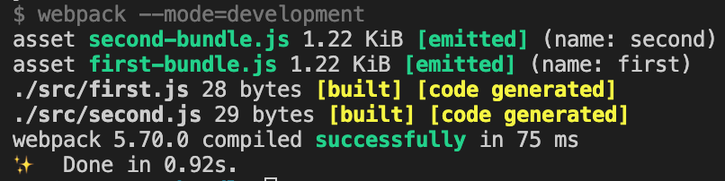
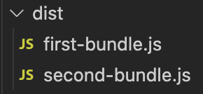

Webpack needs to store the bundle file that it created in some location. Webpack also needs to give proper file names to the bundle file to manage caching. Both these functionalities can be managed using `output` configuration.

> Default value of `output` configuration is `./dist/main.js`.

## Setting output

If we want to store our bundle file as `jam.js` under `jim` folder, we need to add the `output` config to `webpack.config.js` as below.

```javascript
const path = require("path");

module.exports = {
  output: {
    path: path.resolve(__dirname, "jim"),
    filename: "jam.js",
  },
};
```

The value of `output` always need to be an object. We CANNOT give the path as a string(`"./jim/jam.js"`).

Also the `path` property requires an absolute path. That is why, we have to import `path` package to resolve the absolute path. `path` package is part of Node.js and therefore we do not have to install it separately.

> If we are setting `output` config, the only mandatory property is `filename`. Webpack will then create the bundle in `./dist` folder, with the provided file name.

## Multiple Entry Points

We learned about multiple entry points in [Webpack entry config](/blog/webpack-entry-config) article. Here we have a `webpack.config.js` file that handles multiple entry points.

```javascript
module.exports = {
  entry: {
    first: "./src/first.js",
    second: "./src/second.js",
  },
  output: {
    filename: "bundle.js",
  },
};
```

Here, we explicitly mentioned that the output bundle file name should be `bundle.js`. But, since there are two entry points, there will be two output bundles. So, how can two bundles have the same name? That is not possible. That is why, if we try to run webpack with above configuration, we will face below error:

```
Error: Conflict: Multiple chunks emit assets to the same filename bundle.js (chunks first and second)
```

Our expectation is that, webpack will create `first-bundle.js` and `second-bundle.js` under `./dist` folder. For that, we can make use of `[name]` placeholder to provide dynamic naming to output files based on entry points. Here is how the updated config file looks like.

```javascript
module.exports = {
  entry: {
    first: "./src/first.js",
    second: "./src/second.js",
  },
  output: {
    filename: "[name]-bundle.js", // highlight-line
  },
};
```

We can see from the webpack logs that `first-bundle.js` and `second-bundle.js` are emitted. See the green colored text below.



Now, if we check the `dist` folder, we can see the two bundle files as expected.



Hope you understood how Webpack output config works.
