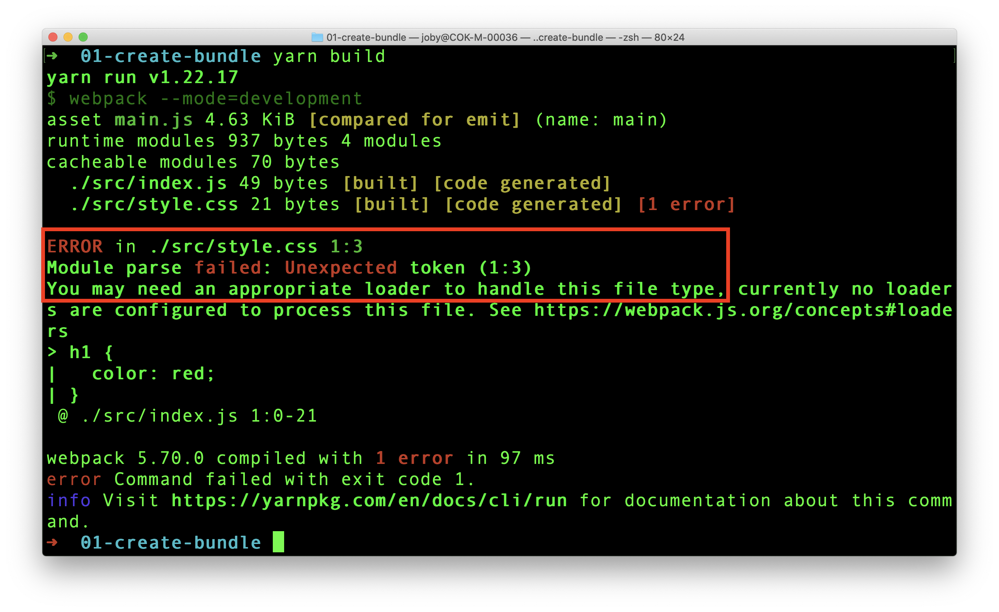
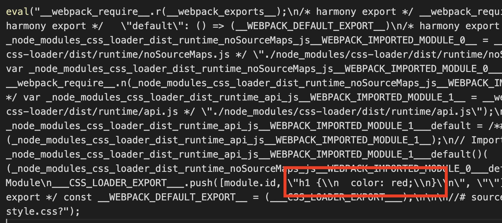
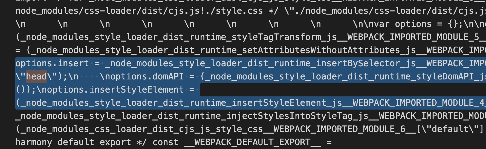
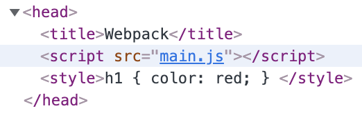

Webpack creates a dependency graph about all the files referenced in our application. It starts with the entry file and go in depth with the help of `import` or `require` statments in the code.

So when webpack sees, `import React from "react"`, it adds the React library to the bundle. Out of the box, Webpack can only understand and include **JavaScript** and **JSON** files.

## CSS Import

What if there is a CSS file import like, `import "./styles.css"`? Let us try it in our code. Say, we have an `index.js` file that imports `style.css`.

Here is our `index.js` file:

```javascript
import "./style.css";

console.log("I am good");
```

And, here is our `style.css` file:

```css
h1 {
  color: red;
}
```

Our expectation is that, Webpack will bundle both the files and creates a `main.js` bundle under `./dist` folder. We do not require an explicit `webpack.config.js` file now. Let us try with the default webpack configuration.

When we try to build the source files, we see below error message in console.



Webpack tried to include `style.css`. But it is not able to understand what is written there. It can understand only **JavaScript** and **JSON**. That is why webpack clearly says in the error message that:

```
You may need an appropriate loader to handle this file type, currently no loaders are configured to process this file.
```

**Loaders** allow webpack to process other types of files and convert them into **valid modules** that can be consumed by your application and added to the dependency graph.

As per the definition of loaders, in order to import a CSS file, we need to use a `css-loader`. Let us add it now.

```
yarn add -D css-loader
```

Now, we have the `css-loader` in place. Let us tell webpack to use it to load CSS files. For that, create the `webpack.config.js` and add below content.

```javascript
module.exports = {
  module: {
    rules: [
      {
        test: /\.css$/i,
        use: ["css-loader"],
      },
    ],
  },
};
```

In the above code, we added a rule for CSS files. So, whenever Webpack sees an CSS import, it uses `css-loader` to add the CSS as a module to the bundle.

Now, things are ready to take a build. Let us run `yarn build` again. It creates a `main.js` bundle under `./dist` folder. If we observe the content, we can see our CSS inside the bundle.



Let us try the bundle in a HTML file and test if the style is applied to `H1` element.

## Testing CSS Bundle

Create a HTML file in `dist` folder. Add `script` reference to our created `main.js` file.

```html
<!DOCTYPE html>
<html lang="en">
  <head>
    <title>Webpack</title>
    <script src="main.js"></script>
  </head>
  <body>
    <h1>Hello World</h1>
  </body>
</html>
```

Open the HTML file in a browser. What do you see? Is the `H1` tag in red color? No. right. That is because, CSS loader can add a CSS file to bundle. But it cannot inject the style to browser DOM. To inject the style to DOM, we need `style-loader`.

## Style Loader

First step is to add the `style-loader`.

```
yarn add -D style-loader
```

Next, add `style-loader` to `webpack.config.js` file.

```javascript
module.exports = {
  module: {
    rules: [
      {
        test: /\.css$/i,
        use: ["style-loader", "css-loader"], // highlight-line
      },
    ],
  },
};
```

We can build the project again using `yarn build`. If we dig deep in the complex `main.js`, we can see some code that injects style to `HEAD` tag.



Now, refresh the HTML page again.


Hooray!, the style is applied. Also, we can see the style inserted to `head` tag.



We learned how to use webpack loader to work with CSS files. There are corresponding loaders for other file types like images, scss files and so on.
