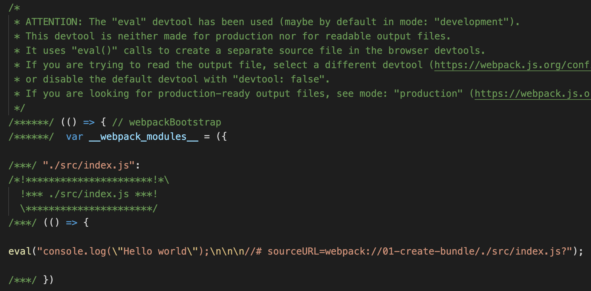
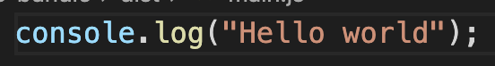
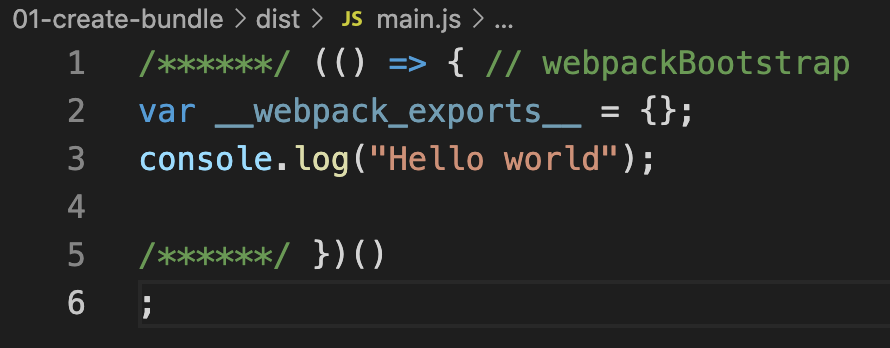

One of the configuration options accepted by Webpack is `mode`. It can have one of the three values.

1. `development`
2. `production`
3. `none`

Webpack generates the bundle in different ways based on the mode type. In development mode, the bundle will be more verbose with comments. In production mode, Webpack does everything to use the bundle for production. It includes minification of the bundle file and other optimizations.

> Default value of `mode` is `production`.

## Setting Mode

In `webpack.config.js`, we can set bundling mode as shown below.

```javascript
module.exports = {
  mode: "development",
};
```

We can also pass the mode using command line flags.

```
webpack --mode=development
```

## Bundle modes

Let us create a small `index.js` file under `./src` folder. Fill it with below content.

```javascript
console.log("Hello world");
```

Now let us see, how the output bundle looks like in different modes.

### Development mode

Here is the output bundle in `development` mode.



As we can see, the generated bundle contains lot of comments. We can also see the `console.log` statement, along with an indicator to original source file.

### Production mode

Here is the generated bundle in `production` mode.



Webpack does not insert anything extra in production mode, just the code that is required.

### None mode

By specifying `none` for `mode`, we are opting out of any optimizations. In our case, the output bundle file looks like below in `none` mode.


