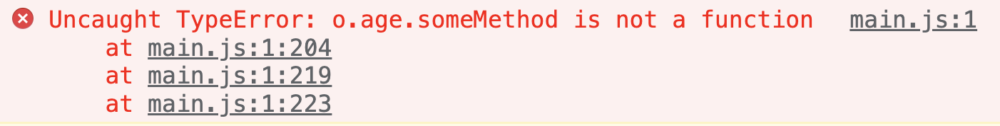
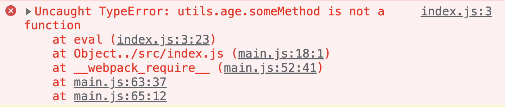
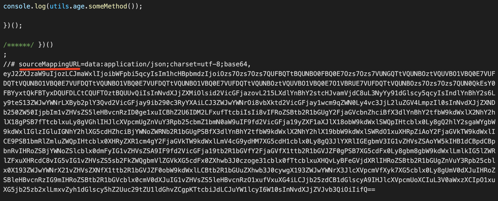

Webpack bundles multiple source files to one single bundle file. In some cases, there can be multiple bundle files. But in both cases, if there is an error in one of the source files, it is **difficult to track** it down from browser console. **Source maps connect the bundle file with corresponding source files**.

> Source maps are not a Webpack only concept. It is a common debugging technique which is respected by all modern browsers. Webpack has the ability to generate source maps.

Let us try generating a source map.

## Project Setup

To try source maps, first let us create two source files under `/src` folder. Name them `index.js` and `util.js`.

Here is the content for `index.js`.

```javascript
const utils = require("./utils");

console.log(utils.age.someMethod());
```

Here is the content of `utils.js`.

```javascript
module.exports = {
  age: 36,
};
```

We have intentionally set an error in `index.js`. `someMethod()` will throw a TypeError.

## Default Source Map Behaviour in Production and Development

Now we have two source files. Take the webpack build with **default configuration**. It is going to be a **production** build. Include the output `main.js` in an HTML file and try it in a browser. Let us see how the error appears in browser.



As we can see, the error is thrown from `main.js`. The browser is not able to show any information about source files to the developer.

Let us now build the project in **development** mode.

In order to take the build in development mode, we need to specify `mode` as `development` in webpack configuration.

```javascript
module.exports = {
  mode: "development",
};
```

Take the build. Then, run the `main.js` bundle in a browser.



We can see the browser console showing the correct **source file** and **line number**. That is because webpack automatically applies a `devtool` setting of `eval` in case of development build. More on `devtool` setting in next section.

## Devtool Option

For sourcemap to be generated, we need to pass another property in webpack configuration called `devtool`. The type of source map changes based on the value given to `devtool` property.

### inline-source-map

One of the several values accepted by `devtool` configuration is `inline-source-map`. Let us first modify our `webpack.config.js`.

```javascript
module.exports = {
  mode: "development",
  devtool: "inline-source-map", // highlight-line
};
```

After build, webpack will generate the source map and include it in the generated bundle file itself. That is why this configuration is called inline source map.



This option is best for development. It is not good for production as it makes bundle size bigger.

### source-map

If we aim to use source map in production, we can use `source-map` value for `devtool`.

```javascript
module.exports = {
  mode: "development",
  devtool: "source-map",
};
```

Here, webpack stores the source map in a different file. That is why it suits production build. If the bundle name is `main.js`, then the map file name will be `main.js.map`.

If we open the `main.js` bundle, the last line will be:

```
//# sourceMappingURL=main.js.map
```

Modern browsers will consider the associate map file by seeing this comment.

There are several other valid values for `devtool` property. You can find the complete list in [webpack docs](https://webpack.js.org/configuration/devtool).
