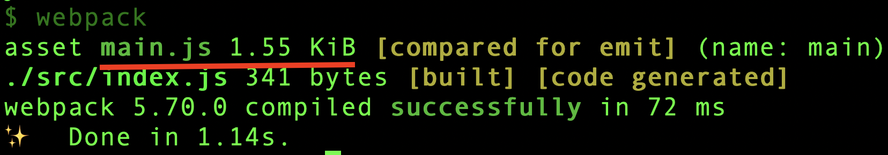
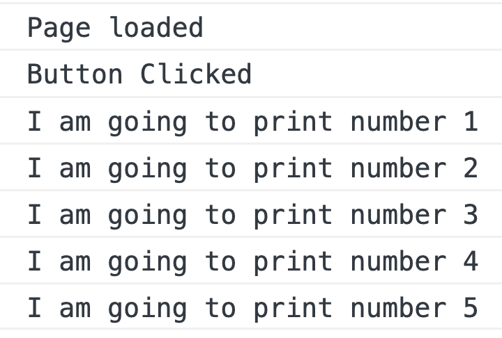
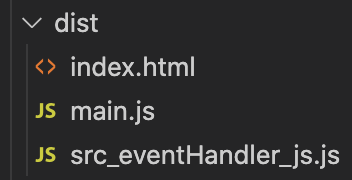

Webpack creates a single bundle file including all the source files. If the bundle size is big, it can impact **initial page load time**. At that time, there is an option to split the bundle to **multipe files** using Webpack and `import()` function.

## Why Code Splitting?

Before doing code splitting, let us understand why we require it in the first place. Create a folder anywhere in your laptop and initialize a node package using `yarn init -y` or `npm init -y`. In order to run `yarn` command, we need to have yarn installed globally.

Next, create an `index.js` file under `/src` folder. Here is the content for that file.

```javascript
console.log("Page loaded");

document.getElementById("mybtn").addEventListener("click", function () {
  console.log("Button Clicked");
  console.log("I am going to print number 1");
  console.log("I am going to print number 2");
  console.log("I am going to print number 3");
  console.log("I am going to print number 4");
  console.log("I am going to print number 5");
});
```

Above code logs a message on page load. It also logs some messages when a button is clicked. We have added 5 console log statements just to increase file size.

### HTML

In order to see the working of above JavaScript code, we need to create a HTML file in `/dist` folder. We are creating in `/dist` folder because after webpack build, the bundle file(`main.js`) is created there.

Create an `index.html` file in `/dist` folder and paste below contents:

```html
<!DOCTYPE html>
<html lang="en">
  <head>
    <title>Document</title>
  </head>
  <body>
    <button id="mybtn">Click Me!</button>
    <script src="./main.js"></script>
  </body>
</html>
```

We have a button added to fire the event we wrote in js file. Also, we placed the script tag at the bottom of file to properly attach the button with the click event.

### Build

We now have the source files and HTML ready. Now, let us configure webpack to run in `development` mode. Here is the content for `webpack.config.js` file.

```javascript
module.exports = {
  mode: "development",
};
```

We can also add a command in `package.json` to run webpack.

```json
"scripts": {
    "build": "webpack"
  },
```

Now, go to project folder in terminal and execute `yarn build`.



A bundle file of size 1.55Kb is created. If we load the HTML in browser and click the button, we can see below output in console.



If we analyze what just happened, we are loading the full bundle file of 1.55Kb on page load. That slows initial page load time. We can split the button click logic to a separate file. That can improve the site performance. In the next section, we will see how it is done.

## Split JS Code

Let us create a separate file under `/src` folder called `eventHandler.js`. We then move all the button click logic to that file.

```javascript
export default () => {
  console.log("Button Clicked");
  console.log("I am going to print number 1");
  console.log("I am going to print number 2");
  console.log("I am going to print number 3");
  console.log("I am going to print number 4");
  console.log("I am going to print number 5");
};
```

Next, we dynamically import this file in `index.js` only on button click.

```javascript
document.getElementById("mybtn").addEventListener("click", function () {
  import("./eventHandler").then((mod) => {
    mod.default();
  });
});
```

When Webpack sees the dynamic `import()` statement, it automatically extract the logic to a separate bundle file.



At the time of page load, only the `main.js` file is loaded. When the button is clicked, Webpack asynchronously request for `src_eventHanlder_js.js` and executes the click handler logic.

This is how code splitting is done using `import()` improves web performance. There are other ways also to implement code splitting.
