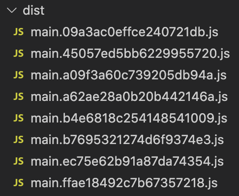

Webpack creates a bundle file from the source files. In webpack configuration file, there is an option to provide the file name of the output bundle file. If the name is **static**, then the browser loads the file for the first time from the server. From the second time, it will take the file from **browser cache**. That will create a problem if bundle file is updated in the server.

In this article, we are trying to find a solution for this caching problem and find out what is the best method to cache.

## Project Setup

First step is to initialize a NPM package using `npm init -y` or `yarn init -y`.

Second step is to install `webpack` and `webpack-cli` as dev dependencies.

```
yarn add -D webpack webpack-cli
```

As third step, add a `build` command under `scripts` in `package.json`.

```json
"scripts": {
    "build": "webpack"
  },
```

Now we are technically ok to try webpack.

## Building Source

Create a folder `src` in our project root. We will store all our source code inside this folder. Create an `index.js` file inside `src` folder and fill it with below content.

```javascript
console.log("Hello World!");
```

Now, take terminal and navigate to our project folder and run:

```
yarn build
```

Above command creates a `dist` folder and places our bundle(`main.js`) inside it. Assume, we included this `main.js` file in our HTML file. When a user first visits the page, `main.js` is downloaded from server. But when the user visits the page next time, the browser will take `main.js` from browser cache. That is good. right? But there is a problem.

## Content Change

What if we change the text in `index.js` to `"Hello universe!!"`? Webpack build followed updated `main.js`. But our browser is still fetching from its cache. How to solve it?

So far, we did not create a `webpack.config.js` because we were using the default options of webpack. Now, create a `webpack.config.js` file. Fill it with below content.

```javascript
module.exports = {
  output: {
    filename: "main.[contenthash].js",
  },
};
```

`[contenthash]` acts like a placeholder. Webpack will calculate the hash value of source files included and fill it in `[contenthash]` placeholder. In our case, when `yarn build` is run, we can see a file like `main.09a3ac0effce240721db.js` in `dist` folder. Again this file will be cached by browser. But, if we make any change to any files and do a build again, the hash value changes. If I change `"World"` to `"Universe"` in `index.js`, I can see that the output bundle file name is now `main.ffae18492c7b67357218.js`. There is no chance that browser serves the bundle from cache now because the file name itself has changed.

## Cleaning Dist Folder

After taking several builds according to new settings, we can see that the `dist` folder is filling up with lot of bundle files.



We can easily solve this problem. `output` configuration in webpack has a `clean` property. If we set the `clean` property to `true`, webpack will clean the `dist` folder in each build. Here is the updated `webpack.config.js` file:

```javascript
module.exports = {
  output: {
    filename: "main.[contenthash].js",
    clean: true, // highlight-line
  },
};
```

## Summary

We learned how to efficiently handle caching in webpack. Using `[contenthash]` placeholder, we can force browsers to fetch latest and updated bundle file after each build. We can also keep our distribution folder clean using the `output.clean` property. Have fun!.
