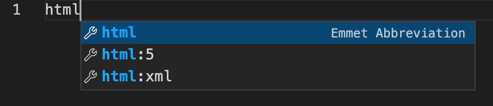

Visual Studio Code is a very popular IDE among web developers. If you are a web developer, you need to fill below code every time a new file is created.

```html
<!DOCTYPE html>
<html lang="en">
  <head>
    <meta charset="UTF-8" />
    <meta http-equiv="X-UA-Compatible" content="IE=edge" />
    <meta name="viewport" content="width=device-width, initial-scale=1.0" />
    <title>Document</title>
  </head>
  <body></body>
</html>
```

We do not have to write again and again in Visual Studio Code. There is a shortcut to add above content easily to a HTML file.

## HTML5 Shortcut

To try the shortcut, create a new **HTML** file in Visual Studio Code. Then, start typing `html`.



From the intellisense dropdown, select `html:5` and press _Enter_ key. Visual Studio automatically brings the boilerplate HTML5 code to the file.

The shortcuts like `html:5` are called **Emmet Abbreviation**. If you are working with some libraries like React, and you wish to have a shortcut to create a component, you can search for React emmet plugins in VS Code. It is available. **ES7+ React/Redux/React-Native snippets** is one such extension.
