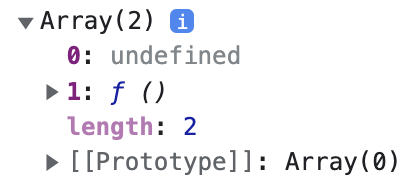

`useState()` hook brings **state** to a functional component. Since it is a hook, it can only be used inside a functional component.

## Import

In order to use `useState()` hook, first we need to import it from `react` package.

```javascript
import { useState } from "react";
```

## Create State Variable

`useState()` hook returns an **array** with **2** elements. First element is the **initial state value**. Second element is a **function** that can update the state.

```javascript
const arr = useState();
console.log(arr);
```

Here is the output.



Usually, in code, we assign the state variable and the setter function to new variables using destructuring. If we need a state variable to store `color` information, we can create it like below:

```javascript
const [color, setColor] = useState();
```

## Default State Value

We can pass an argument to `useState()` which turns to be the initial state value. In the above example, if the state variable `color` needs to be set with `"black"` initially, we can update the code as below:

```javascript
const [color, setColor] = useState("black");
```

By default, if we do not pass any initial state value, `undefined` is assigned to `color`.

## Updating State

`setColor` is a function. Invoking that function with a new state value, updates the state.

```javascript
setColor("red");
```

Each time `setColor()` is called or in other words, each time when the state is updated, the component is **re-rendered**.

```javascript
import { useState } from "react";

export default function App() {
  const [color, setColor] = useState("orange");

  return (
    <button
      onClick={() => {
        setColor("red");
      }}
      style={{ backgroundColor: color }}
    >
      Change Color
    </button>
  );
}
```

Above code sets `"orange"` as the default color. On click of the button, the state value is changed to `"red"`. You can try the code online in [CodeSandbox](https://codesandbox.io/s/react-hooks-idcwej?file=/src/useState/basic.js).

## Multiple State Values

We can declare more than one state variables inside a functional component using multiple `useState()` invokations.

```javascript
const [color, setColor] = useState();
const [width, setWidth] = useState();
const [interest, setInterest] = useState();
```
