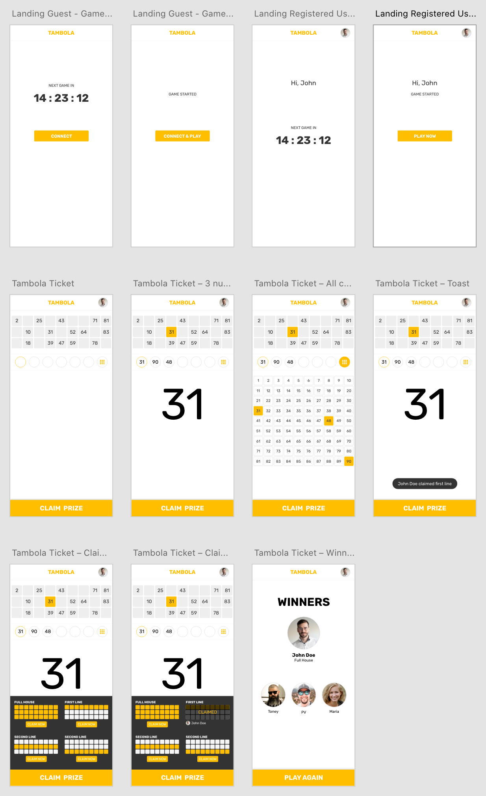

Tambola is a social game. It is also known as Bingo. I am working to develop an online Tambola game to learn different things related to product development. I am trying to share my findings here.

<!-- truncate -->

## Why Tambola?

I was thinking about developing a product for a long time. After thinking about different ideas like quiz, jigsaw puzzle or something small, every time I was more attracted to Tambola. I think the reasons are:

- Tambola games can be generated each time with code. Other games like quiz requires frequent question set updation.
- More users might be willing to participate Tambola compared to other games.
- The rules and skill set required to play this game are simple.
- More can be learned about real time data updation and concurrent requests.
- It is real fun to play. I have hosted several Tambola games in social gatherings and love it.

## First Step

It is always difficult to start. I used to procrastinate for around 6 months. During this time, I tried few Tambola related designs using HTML and CSS.

- Design Tambola Cell Using HTML And CSS
- Create a Tambola Ticket Using HTML and CSS

In around **Jan 2022**, I made up my mind to complete the screens required for this game. I used **Adobe XD** to draw the mockup. Even though I am not a UX designer, I managed to come up with a viable design, good enough to start.

The screens are designed for mobiles. I assume the game will be mainly played from mobile devices. I am lazy to draw the designs for desktop.

**Apr 16, 2022**

## Development Environment

I planned to start a React application from scratch. I decided not to go with `create-react-app`. Here are few steps which I had to take:

- Setup a React project where I could develop all the screens
- Define styles and resusable components on the go
- Version the project using a [Github repo](https://github.com/jobyjoseph/Tambola).
- Setup a CI/CD to build the code and push it to AWS S3 to see the running app

All these steps are purely for development purpose. Here, I have documented some of my learnings.

- Hosting Static React Website in AWS S3
- [Deploy React App to Amazon S3 Using Github Actions](/blog/deploy-react-app-amazon-s3-github-actions)
