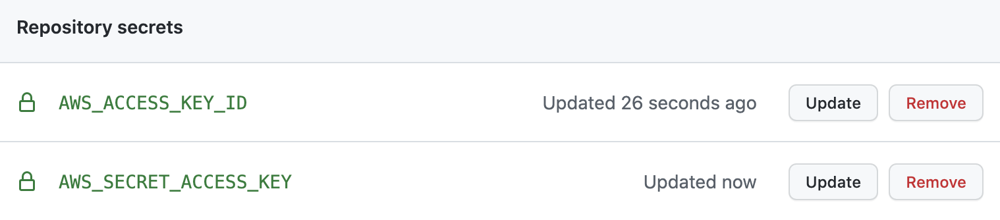
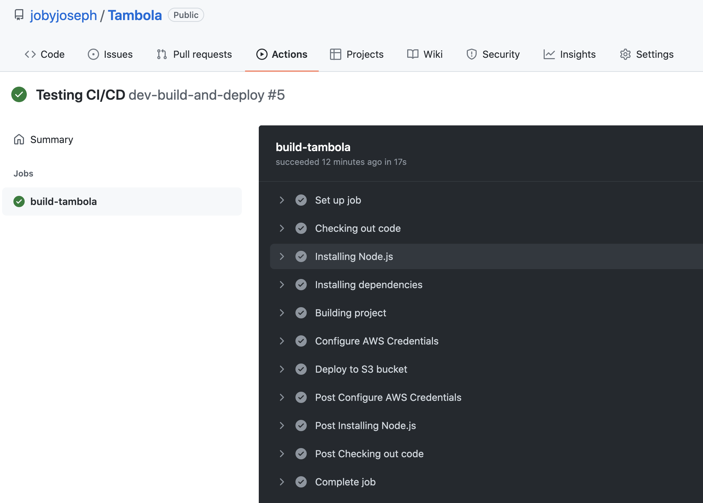

We are going to setup a development work-flow using which, our code pushed to **Github will be automatically deployed to AWS S3**.

## AWS IAM User

If we need to deploy our React application to AWS, we need to use our AWS credentials. In the same line, if Github needs to deploy our applcation to AWS, it needs valid AWS credentials.

For that, we create an IAM user to be used by Github. This IAM user will only have **enough permission** to deploy our code.

> Here is the [link](https://docs.aws.amazon.com/IAM/latest/UserGuide/id_users_create.html) to AWS documentation about creating IAM users.

I created a user with username `githubuser`. You can give any user name. Only programmatic access is required for this user.

Also, I gave permission only to S3 service. My policy json looks like this:

```json
{
  "Version": "2012-10-17",
  "Statement": [
    {
      "Sid": "VisualEditor0",
      "Effect": "Allow",
      "Action": ["s3:*", "s3-object-lambda:*"],
      "Resource": "*"
    }
  ]
}
```

After creating the IAM user, we will get an _Access Key ID_ and _Secret Access_. Store it somewhere safe.

## Github Secrets

When Github does the deployment for us to AWS S3, it requires AWS credentials which we created. These credentials must be stored somewhere safe, but at the same time accessible to Github actions. **Github Secrets** is the answer.

Go to our repo > **Settings** > **Secrets** > **Actions**. Add two repository secrets with name `AWS_ACCESS_KEY_ID` and `AWS_SECRET_ACCESS_KEY`. Provide the credential values to each secrets.



We just set two environment variables in Github environment. We will be using those in Github actions.

## Github Actions

Our goal is to build and deploy code from `dev` branch to AWS S3, when code is pushed to `dev` branch. Github Actions is a CI/CD platform.

To use Github Actions, create a folder `.github/workflows` in the project root. We write workflows in **YAML files**. Create `dev-build-deploy.yml` file under `workflows` directory. Paste below YAML code:

```yml
# Name of workflow as seen in Github actions tab
name: dev-build-and-deploy
# Run workflow only on push to dev branch
on:
  push:
    branches:
      - dev
jobs:
  # To build the project
  build-tambola:
    runs-on: ubuntu-latest
    steps:
      - name: Checking out code
        uses: actions/checkout@v3
      - name: Installing Node.js
        uses: actions/setup-node@v3
        with:
          node-version: "16"
      - name: Installing dependencies
        run: npm install
      - name: Building project
        run: npm run build
      - name: Configure AWS Credentials
        uses: aws-actions/configure-aws-credentials@v1
        with:
          aws-access-key-id: ${{ secrets.AWS_ACCESS_KEY_ID }}
          aws-secret-access-key: ${{ secrets.AWS_SECRET_ACCESS_KEY }}
          aws-region: us-west-1

      - name: Deploy to S3 bucket
        run: aws s3 sync ./dist/ s3://dev-tambola --delete
```

We can see above YAML content as the instructions to Github. Where ever we see `name` key, that will be used by Github Actions console to show the message.

Here are the different steps defined in the YAML file:

- Run the workflow only when someone pushes code to `dev` branch
- Take a VM with latest Ubuntu OS for running the next steps
- Checkout the code from `dev` branch
- Install Node.js v16 in the VM to enable NPM command
- Install project dependencies
- Build the project to create `/dist` folder with deployable files
- Configure AWS credentials using `aws-actions`
- Upload contents from `/dist` folder to our S3 bucket

Save the YAML file. Then, push all code to remote `dev` branch. Immediately, go to Github actions tab in Github site. There we can see our workflow running.



Once all the steps are complete, we can see our S3 [link](http://dev-tambola.s3-website-us-west-1.amazonaws.com) updated with latest changes.

## Summary

In this article, I hope I could explain things related to:

- Create AWS IAM user for CI/CD pipelines
- Store credentials in Github secrets instead of using directly in code
- Enable Github Actions workflow in a repository
- Write Github Actions YAML file to define build and deployment rules
