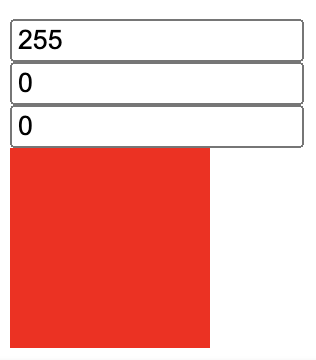

`useReducer()` is also used to maintain state in a component just like `useState()`. But, it differs in how it is used. If we are planning to store an object in state, `useReducer()` will be a better choice in most of the cases.

## Without useReducer()

We are going to store an object in state using `useState()`. You can see the working demo and code in [CodeSandbox](https://codesandbox.io/s/react-hooks-idcwej?file=/src/useReducer/with-state.js). Here is the initial object value that stores RGB color information.

```javascript
{
  red: 0,
  green: 0,
  blue: 0,
};
```

The state is set using `useState()` syntax:

```javascript
const [rgb, setRGB] = useState({
  red: 0,
  green: 0,
  blue: 0,
});
```

We have 3 textboxes to update the value of red, green and blue color.

```javascript
<input
    type="text"
    placeholder="Red"
    onChange={(e) => {
        updateColor("red", e.target.value);
    }}
    value={rgb.red}
/>
<br />
<input
    type="text"
    placeholder="Green"
    onChange={(e) => {
        updateColor("green", e.target.value);
    }}
    value={rgb.green}
/>
<br />
<input
    type="text"
    placeholder="Blue"
    onChange={(e) => {
        updateColor("blue", e.target.value);
    }}
    value={rgb.blue}
/>
```

All input fields calls the same function, `updateColor()`.

```javascript
const updateColor = (color, value = 0) => {
  const newRGB = { ...rgb };
  newRGB[color] = value;
  setRGB(newRGB);
};
```

The function creates a copy of `rgb` object. Then update the value of the color and set the new value to state.

At any time, we show the color corresponding to `rgb` object using a `div` tag.

```javascript
<div
  className="rgb-container"
  style={{ background: `rgb(${rgb.red},${rgb.green},${rgb.blue})` }}
></div>
```

Here is the output for our work:



## With useReducer()

Now let us see how we can implement the same using `useReducer()` hook. First step is to import `useReducer` from React.

```javascript
import { useReducer } from "react";
```

Next, here is how we use the hook:

```javascript
const [rgb, dispatch] = useReducer(reducer, {
  red: 0,
  green: 0,
  blue: 0,
});
```

`useReducer()` hook accepts two arguments. One is the **reducer** function and second one being the **initial state**. The hook returns the **state** and a function to **dispatch actions**.

`dispatch()` function is invoked whenever we need to update the state. When invoking the function, we need to pass an **action**. Action is simply an object literal. It needs to have a `type` property. We can have additional properties also. Example, in our RGB project, to update the value of red color, the **action** object looks like below:

```javascript
{
  type: "SET_RED",
  value: 200
}
```

Let us add the `dispatch()` invocation for our 3 textboxes.

```javascript
<input
  type="text"
  placeholder="Red"
  onChange={(e) => {
    dispatch({
      type: "SET_RED",
      value: e.target.value
    });
  }}
  value={rgb.red}
/>
<br />
<input
  type="text"
  placeholder="Green"
  onChange={(e) => {
    dispatch({
      type: "SET_GREEN",
      value: e.target.value
    });
  }}
  value={rgb.green}
/>
<br />
<input
  type="text"
  placeholder="Blue"
  onChange={(e) => {
    dispatch({
      type: "SET_BLUE",
      value: e.target.value
    });
  }}
  value={rgb.blue}
/>
<br />
```

Let us do a walkthrough. When we change the value in _Green_ textbox to say `154`, `onChange()` event is fired. The event calls the `dispatch()` function with an _action_ object. Everytime, when `dispatch()` is called, it then calls the `reducer()` function to update the state. The `reducer()` function always accepts the current state and the passed action object. The value returned by the `reducer()` function is set as the new state.

In our example, when the reducer function is invoked, the control jumps to `SET_GREEN` case. There the value of `green` is updated to `154` and the new state object is returned.

You can see the working demo and code in [CodeSandbox](https://codesandbox.io/s/react-hooks-idcwej?file=/src/useReducer/with-reducer.js).
