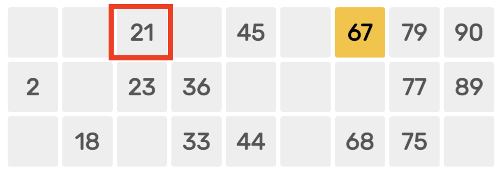

Just like CSS is used to style HTML page, **Styled Components** is one of the way to style React components. How we use Styled Components differs from normal CSS. Styled Components follow a CSS-in-JS approach.

This article is part of setting up a [Tambola game](/blog/tambola-game-development-part-1). The learnings through the journey is documented in this blog.

## Planning React Component

The goal is to create a React component that renders a single cell of a Tambola Card.



Here is the `TambolaCell` component.

```javascript
const Tambolacell = (props) => {
  return (
    <Cell numberCalled={props.numberCalled}>
      <Helmet>
        <link rel="preconnect" href="https://fonts.googleapis.com" />
        <link rel="preconnect" href="https://fonts.gstatic.com" crossorigin />
        <link
          href="https://fonts.googleapis.com/css2?family=Rubik:wght@400;700&display=swap"
          rel="stylesheet"
        />
      </Helmet>
      12
    </Cell>
  );
};
```

The `Cell` component used is a Styled Component which we will see in the next section.

The component uses `Rubik` Google font. The reference to the font is added in `<head>` using `react-helmet` package.

## Using Styled Component

We need to install `styled-components`. Then import it using:

```javascript
import styled from "styled-components";
```

We can then create a React component with style like this:

```javascript
export const Cell = styled.div`
  background: ${(props) => (props.numberCalled ? "#ffbf00" : "#eee")};
  color: #333;
  font-size: 18px;
  font-family: "Rubik", sans-serif;

  display: flex;
  width: 38px;
  height: 38px;
  justify-content: center;
  align-items: center;

  border-radius: 3px;
`;
```

This is how the `Cell` component in previous section was created. The props we pass to `Cell` component can be read inside the component like:

```javascript
background: ${(props) => (props.numberCalled ? "#ffbf00" : "#eee")};
```

## Output

Here we use the component with and without props.

```javascript
<TambolaCell />
<br />
<TambolaCell numberCalled />
```

And here is the output:


