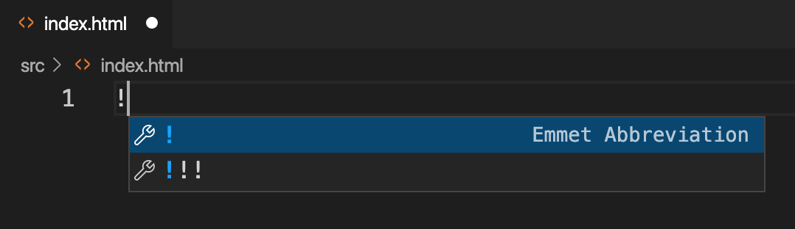
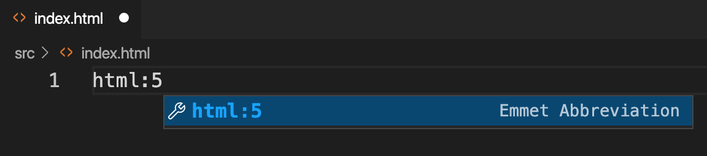
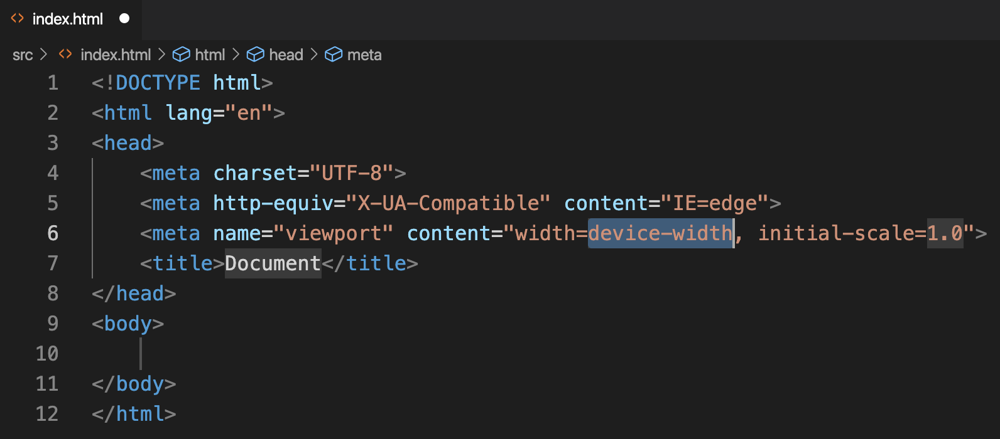

When starting a HTML5 document, it is quite boring to copy paste or type the basic structure of a HTML5 document. In most of the IDEs there are shortcuts to insert frequently used code snippets. Such shortcuts are called as **Emmets**.

There is an Emmet for inserting HTML5 document in Visual Studio Code. They are `!` and `html:5`. Here are the steps to use this emmet.

Create or open an empty html document. Then start typing `!` or `html:5`. Visual Studio Code recognizes it as an Emmet.

Here is how we use emmet with `!`.

Here is how we use emmet with `html:5` short code.

Once we use the emmet by pressing _Enter_ key, this is how the generated HTML code looks like:

