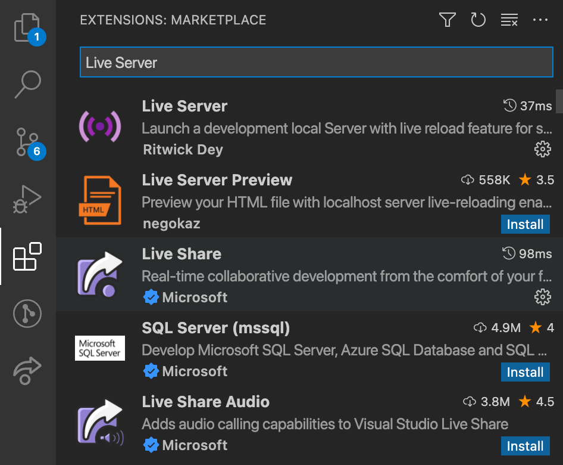
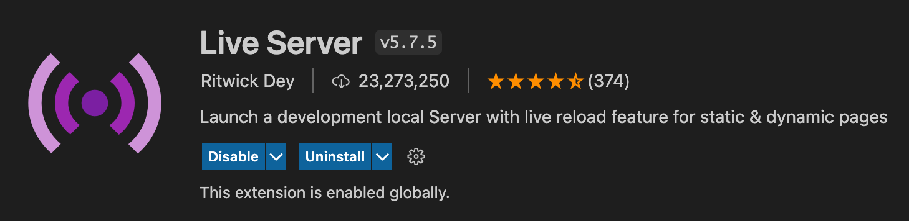
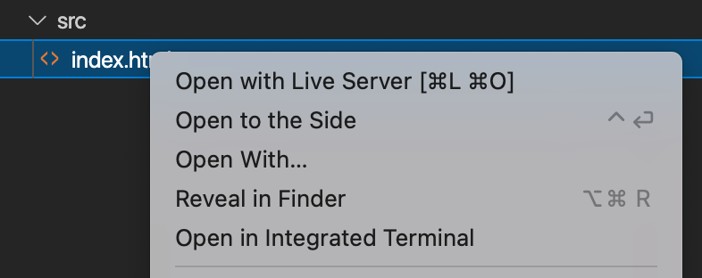

[Live Server](https://marketplace.visualstudio.com/items?itemName=ritwickdey.LiveServer) is a Visual Studio Extension that saves a lot of time for me. Initial days, when I need to run a website from live server using a url like `http://localhost`, I depended on [apache server](https://www.mamp.info/en/mac/). Sometimes I tried Google extension called [200 Ok](https://chrome.google.com/webstore/detail/web-server-for-chrome/ofhbbkphhbklhfoeikjpcbhemlocgigb?hl=en).

In order to install this extension, we need to open Visual Studio Code. Then take _Extensions_ tab and search for _Live Server_.

Then choose the one shown below and click the _Install_ button. In my case, I have already installed. That is why it is showing _Uninstall_ button in the screenshot.

Once the extension is installed, we can easily open a file using Live Server by right clicking the file and open it with Live Server.

