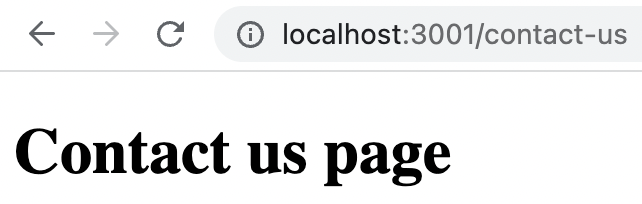
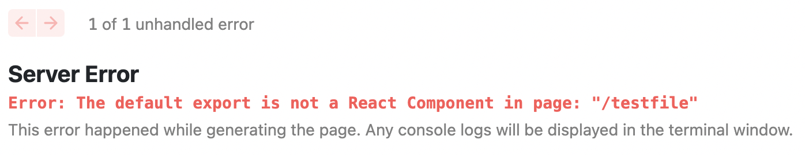

Next.js is a React framework to build websites. Next.js creates page routes based on file and folder structure. For example, if we want to create a url like `/contact-us`, we need to create a JavaScript file with file name `contact-us.js` under `/pages` folder.

Each JavaScript file should export a **React Component**. Here is an example content that can go inside `contact-us.js`:

```javascript
const ContactUs = () => {
  return <h1>Contact us page</h1>;
};

export default ContactUs;
```

<!-- truncate -->

If we run the project, we can see below page in `/contact-us` url.



## Non React JavaScript file

As mentioned earlier, each page files should return a React component. What if we are simply creating a JavaScript file under `/pages` folder? Let us try.

For that, create a file under `/pages` folder with name `testfile.js`. Fill the file using below content:

```javascript
console.log("Test file");
```

Now try to access `/testfile` url. Next.js will clearly show the error to us as shown below:



## Nested URL

If we want to create a URL like `/students/list`, then we need to first create `list.js` file under `/pages/students` folder.

The `list.js` file should return a React component.
