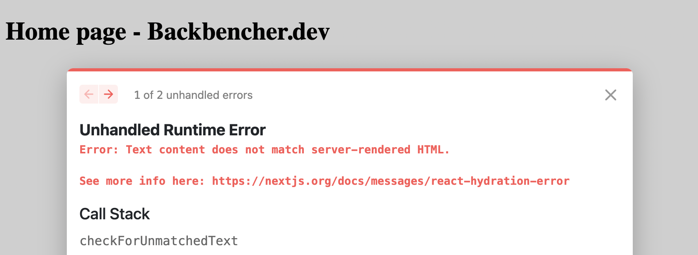

Next.js supports inserting JavaScript code to our project in various ways. We are going to explore how we can add and run a piece of inline JavaScript code in a Next.js component.

Here we have a piece of JavaScript code:

```javascript
console.log("This is an inline JavaScript");
```

<!-- truncate -->

I am trying to insert it directly to my Next.js home page like below:

```javascript
const Home = () => (
  <div>
    <h1>Home page - Backbencher.dev</h1>
    <script>console.log("This is an inline JavaScript");</script>
  </div>
);
```

But when I take the home page, I am seeing an error. It says:

```
Unhandled Runtime Error
Error: Text content does not match server-rendered HTML.

See more info here: https://nextjs.org/docs/messages/react-hydration-error
```



We can take the help of **dangerouslySetInnerHTML** in this case. We need to replace the `script` tag with:

```javascript
<script
  dangerouslySetInnerHTML={{
    __html: `console.log("This is an inline JavaScript");`,
  }}
/>
```

After that we can see the message correctly logged in the console.
