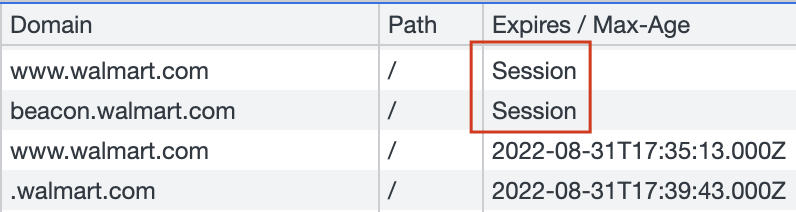
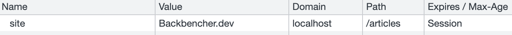

A session cookie is a browser cookie that has validity only for that session. For example, when the user logs in, we might store the access token in a session cookie.

Here is how we can see a session cookie in browser console:



<!-- truncate -->

Browser automatically destroys session cookies when it is closed. Closing just the tab, will not kill the session cookies.

If we are creating a Session cookie using JavaScript, do not provide the expiry date. A cookie without expiry is going to be a session cookie by default.

Here is a code sample:

```javascript
document.cookie = "site=Backbencher.dev";
```

You can try out this code from the browser console. After that, we can see the session cookie created.


