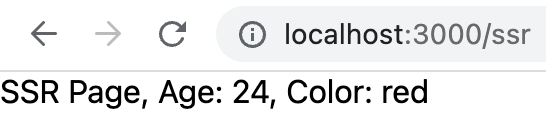
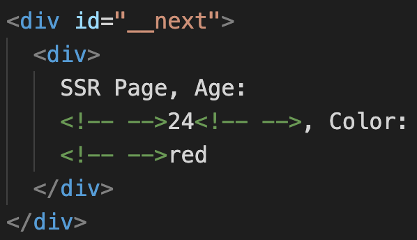
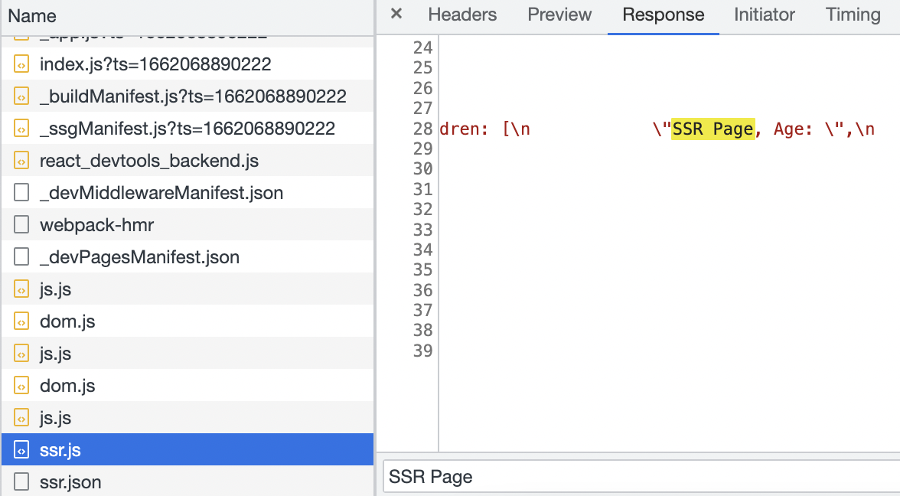
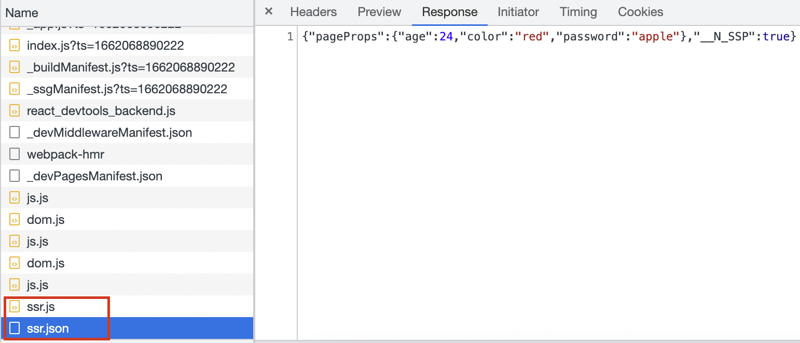

Next.js is an isomorphic app framework. If I visit a url directly in the browser, Next.js renders the page in the server. Instead, if we visit the url through a link, then the page is rendered client side just like SPA applications.

It was and still is a miracle for me. I was playing with Next.js and trying to understand how Next.js implement this feature. I can say I am still learning. I am expressing only the very high level knowledge which I got.

<!-- truncate -->

## Two pages

First I created two pages, `/` and `/ssr`. `/ssr` is a server side rendered page because it contains `getServerSideProps()`. Home page is just to have a hyperlink to `/ssr` page.

Here is the code for `Home` page:

```javascript
import Link from "next/link";

export default function Home() {
  return (
    <div>
      <Link href="/ssr">SSR</Link>
    </div>
  );
}
```

We need to use `Link` from `next` for client side rendering. `Link` component has logic to do the client side routing, just like React Router.

And here is the code for `SSR` page:

```javascript
export async function getServerSideProps(context) {
  return {
    props: {
      age: 24,
      color: "red",
      password: "apple",
    },
  };
}

export default function SSR({ age, color }) {
  return (
    <div>
      SSR Page, Age: {age}, Color: {color}
    </div>
  );
}
```

You need to note few things in the above `SSR` component:

1. SSR page will always be rendered in the server side because it has got `getServerSideProps` function.
2. The `getServerSideProps()` function return 3 props values, `age`, `color` and `password`.
3. But we are using only 2 props values inside `SSR` component.

## Server Side Rendering

In order to experience Server Side Rendering, I directly took `http://localhost:3000/ssr` in browser. I could see the output:



If the page is server side rendered, then I should see the HTML structure with data directly in the view-source. So I checked the source code in browser and found this:



Yay! Server side rendering is working fine as expected.

On an added note, I also found Next.js returning the full props returned by `getServerSideProps()` in the returned HTML. This is for hydrating correctly(Hydration is a separate topic).

```html
<script id="__NEXT_DATA__" type="application/json">
  {
    "props": {
      "pageProps": { "age": 24, "color": "red", "password": "apple" },
      "__N_SSP": true
    },
    "page": "/ssr",
    "query": {},
    "buildId": "development",
    "isFallback": false,
    "gssp": true,
    "scriptLoader": []
  }
</script>
```

So even if we are not using the props value in our page, Next.js is returning it to client. So we should not return any secure content from `getServerSideProps()`.

## Client Side Rendering

Next I tested how the `/ssr` page is loaded if I clicked on the link in home page.

It was a client side rendering. How I found out is that, In my browser dev tools `Preserve log` option was turned off. So, If it was server-side routing, then the network tab will be erased and loaded again. That did not happen.

When I clicked on the link, Next.js might have done a dynamic import of my `SSR` component. I could see a call to `ssr.js` which contained code of my `SSR` component.



After that Next.js made a call to `/ssr.json`. What I understood is, any page with `getServerSideProps()` can be called as a data API endpoint. Example, here we have `/ssr` page. If we request `/ssr.json`, Next.js will run the `getServerSideProps()` of `/ssr` page and returns the props as JSON.

Next.js will then hydrate previously fetched SSR component with this data. That is the purpose of `ssr.js` and `ssr.json` calls in the network tab.



This is a self taught understanding of how Next.js does isomorphic rendering :).
