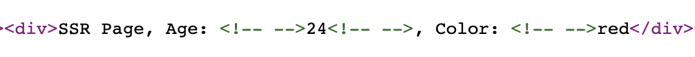

Next.js is a React framework to build **Isomorphic applications**. Isomorphic applications support both client side and server side rendering.

Server side rendering means the complete HTML structure and its contents are gathered and rendered in the server. In case of Next.js, the server is a **Node.js server**.

Server side pages are usually **dynamic**. Example, a blog post or a product details page in ecommerce site.

<!-- truncate -->

## getServerSideProps()

How Next.js decides if a page needs to be rendered in server side or client side? If we export a function with the name `getServerSideProps` in a page, Next.js always do server side rendering for that page.

Let us try it out. Spin up a Next.js application. Create a page by creating a file `ssr.js` under `/pages` folder.

Here is the initial content of `ssr.js`:

```javascript
export async function getServerSideProps(context) {
  return {
    props: {}, // will be passed to the page component as props
  };
}

export default function SSR() {
  return <div>SSR Page</div>;
}
```

Above code shows how `getServerSideProps()` need to be used.

## Passing Props

`getServerSideProps()` can return an object with `props`.

```javascript
export async function getServerSideProps(context) {
  return {
    // highlight-start
    props: {
      age: 24,
      color: "red",
    },
    // highlight-end
  };
}
```

Since this function purely runs in server, we can include any secure stuff like Db connection or other credentials here. After completing any server-side logic, the `props` value returned by the function can be obtained by the page component as shown below.

```javascript
export default function SSR({ age, color }) {
  return (
    <div>
      SSR Page, Age: {age}, Color: {color}
    </div>
  );
}
```

Since the page is rendered in the server side, we can see the html source by taking the _view source_ of the page.



> Even though SSR happens in server side, Next.js sends the complete props object to client side for correct hydration. We can see it in the HTML view source.

```javascript
<script id="__NEXT_DATA__" type="application/json">
    {
    "props": {
        "pageProps": { "age": 24, "color": "red", "password": "apple" },
        "__N_SSP": true
    },
    "page": "/ssr",
    "query": {},
    "buildId": "development",
    "isFallback": false,
    "gssp": true,
    "scriptLoader": []
    }
</script>
```

You can see `password` above in the view source, even if we are not using or showing it in the HTML. Due to this behaviour, we should not send any sensitive information in the page props.
