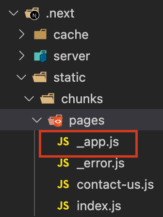
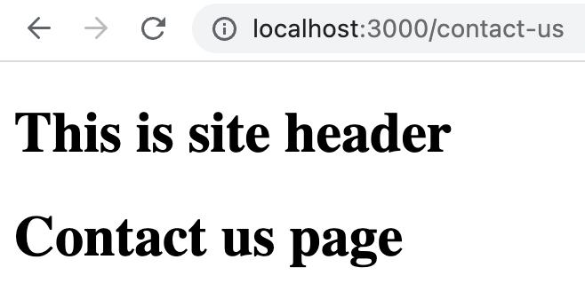

Next.js initializes all pages using an `App` component. In other words, this `App` component acts as a **Higher Order Component(HOC)** of all pages. Using an `App` component is part of internal working of Next.js. During build step, Next.js creates a `.next` folder and stores the output files inside it.

If we open, `.next/static/chunks/pages` folder, we can see an `_app.js` automatically generated.

<!-- truncate -->



## Understanding Page Layout

We have a page component in `pages/contact-us.js`. It contains a very simple React component which is shown below:

```javascript
const ContactUs = () => {
  return <h1>Contact us page</h1>;
};

export default ContactUs;
```

Let us now see the output page in browser and go its source. Oh God!, there is lot of HTML!:

```html
<!DOCTYPE html>
<html>
  <head>
    <style data-next-hide-fouc="true">
      body {
        display: none;
      }
    </style>
    <noscript data-next-hide-fouc="true"
      ><style>
        body {
          display: block;
        }
      </style></noscript
    >
    <meta charset="utf-8" />
    <meta name="viewport" content="width=device-width" />
    <meta name="next-head-count" content="2" />
    <noscript data-n-css=""></noscript>
    <script
      defer=""
      nomodule=""
      src="/_next/static/chunks/polyfills.js?ts=1662335288426"
    ></script>
    <script
      src="/_next/static/chunks/webpack.js?ts=1662335288426"
      defer=""
    ></script>
    <script
      src="/_next/static/chunks/main.js?ts=1662335288426"
      defer=""
    ></script>
    <script
      src="/_next/static/chunks/pages/_app.js?ts=1662335288426"
      defer=""
    ></script>
    <script
      src="/_next/static/chunks/pages/contact-us.js?ts=1662335288426"
      defer=""
    ></script>
    <script
      src="/_next/static/development/_buildManifest.js?ts=1662335288426"
      defer=""
    ></script>
    <script
      src="/_next/static/development/_ssgManifest.js?ts=1662335288426"
      defer=""
    ></script>
    <noscript id="__next_css__DO_NOT_USE__"></noscript>
  </head>
  <body>
    <div id="__next"><h1>Contact us page</h1></div>
    <script src="/_next/static/chunks/react-refresh.js?ts=1662335288426"></script>
    <script id="__NEXT_DATA__" type="application/json">
      {
        "props": { "pageProps": {} },
        "page": "/contact-us",
        "query": {},
        "buildId": "development",
        "nextExport": true,
        "autoExport": true,
        "isFallback": false,
        "scriptLoader": []
      }
    </script>
  </body>
</html>
```

From the HTML, try to find this line `<div id="__next"><h1>Contact us page</h1></div>`. We can see that our `Contact Us` page component is wrapped inside `<div id="__next"/>` by the `App` component.

We do not have to worry about how other html tags are brought to the page. Let us focus on the content inside `<div id="__next" />`.

## Customizing App Component

Since all pages are initialized and passed through `App` component, we can actually setup website layouts in `App` component. But how can we know where is the `App` component? We do not have to know that. Next.js has given an option to override and customize `App` component.

In order to do that, first we need to create an `_app.js` inside `pages` folder. The file can contain below content initially. We will update it later.

```javascript
function MyApp() {
  return (
    <div>
      <h1>This is site header</h1>
    </div>
  );
}

export default MyApp;
```

Now start the Next.js app.

> If your Next.js app is already running, restart it. Otherwise `App` component changes will not reflect.

Now take any page in your site. What I am seeing is, irrespective of the url, the page is showing only the site header. Individual page contents are not displayed.

### Page Component and Props

The `App` component is always receiving the page component and its props. We need to render the page component JSX and its props. Then only we can see the page contents.

```javascript
function MyApp({ Component, pageProps }) {
  return (
    <div>
      <h1>This is site header</h1>
      <Component {...pageProps} />
    </div>
  );
}

export default MyApp;
```

After making this change, let us visit `contact-us` page again.


