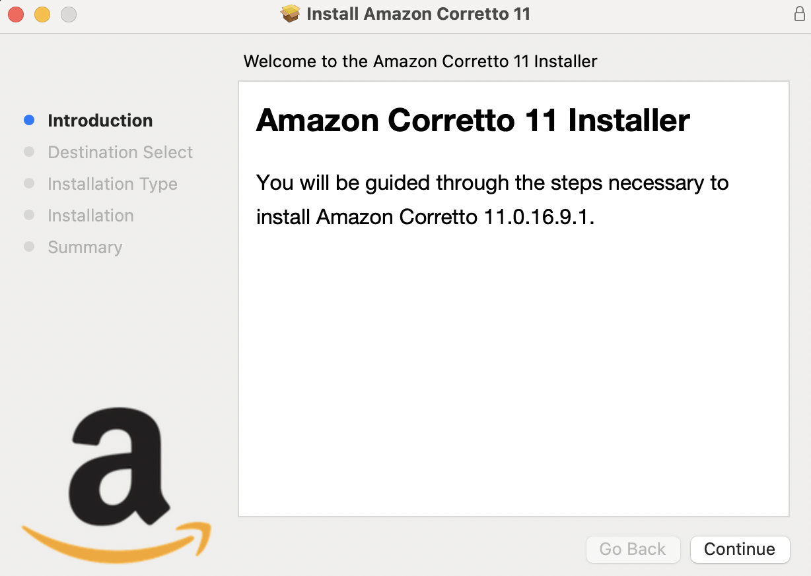
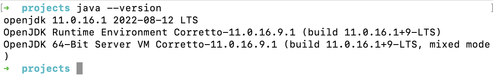

In order to compile and run Java programs we need Java Development Kit(JDK). Mine is a Macbook with M1 chip. Here is how I installed JDK.

<!-- truncate -->

## Amazon Corretto

Amazon Corretto is a no-cost, multiplatform, production-ready distribution of the Open Java Development Kit (OpenJDK).

First step is to download the package from [Amazon Corretto Downloads](https://docs.aws.amazon.com/corretto/latest/corretto-11-ug/downloads-list.html) page.

From the page, we need to download the package under **macOS aarch64**.

## Installation

Open the `.pkg` file. It will open an installer.



Follow the instructions to complete the installation.

## Verification

After successful installation, we can take the terminal and try:

```
java --version
```

Above command displays the installed Java version.


