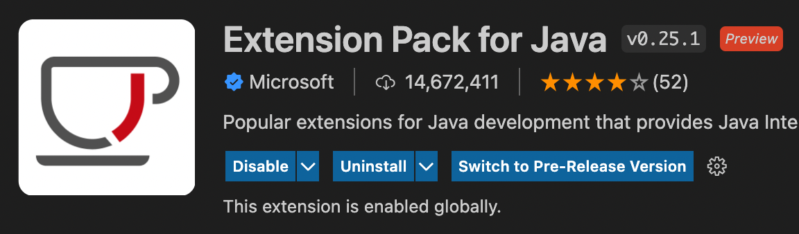
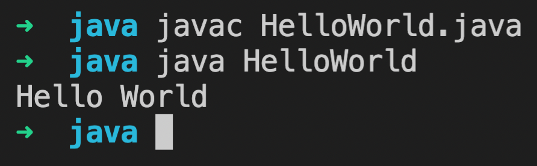

Visual Studio is a **free** and **light weight IDE** maintained by Microsoft. It has good support for Java programming language.

VS Code does not install JDK for you. You can install it separately using tools like [Amazon Corretto](/blog/install-java-jdk-macbook-m1-chip).

If you do not have VS code installed, download and install it first.

Next, we need to find and install **Extension Pack for Java**.



## HelloWorld Java

Create a folder anywhere to store the Java files. Open the folder in VS Code.

Create a new file `HelloWorld.java` and paste below content.

```java
public class HelloWorld {
    public static void main(String[] args) {
        System.out.println("Hello World");
    }
}
```

VS Code comes with a terminal. Open a new terminal. Run below command to build the Java code.

```
javac HelloWorld.java
```

If the build is successful, you can see a `HelloWorld.class` created. Next we can run the program using:

```
java HelloWorld
```

We can find the output like below:


