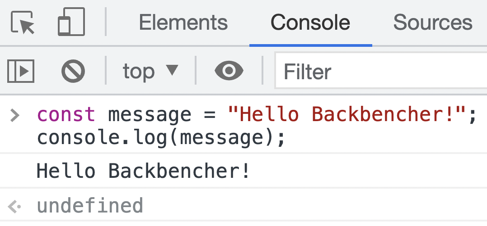
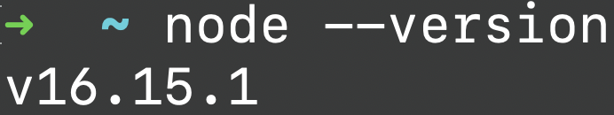
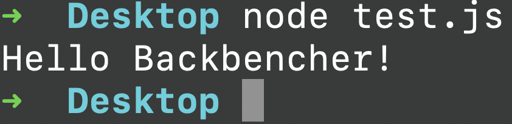
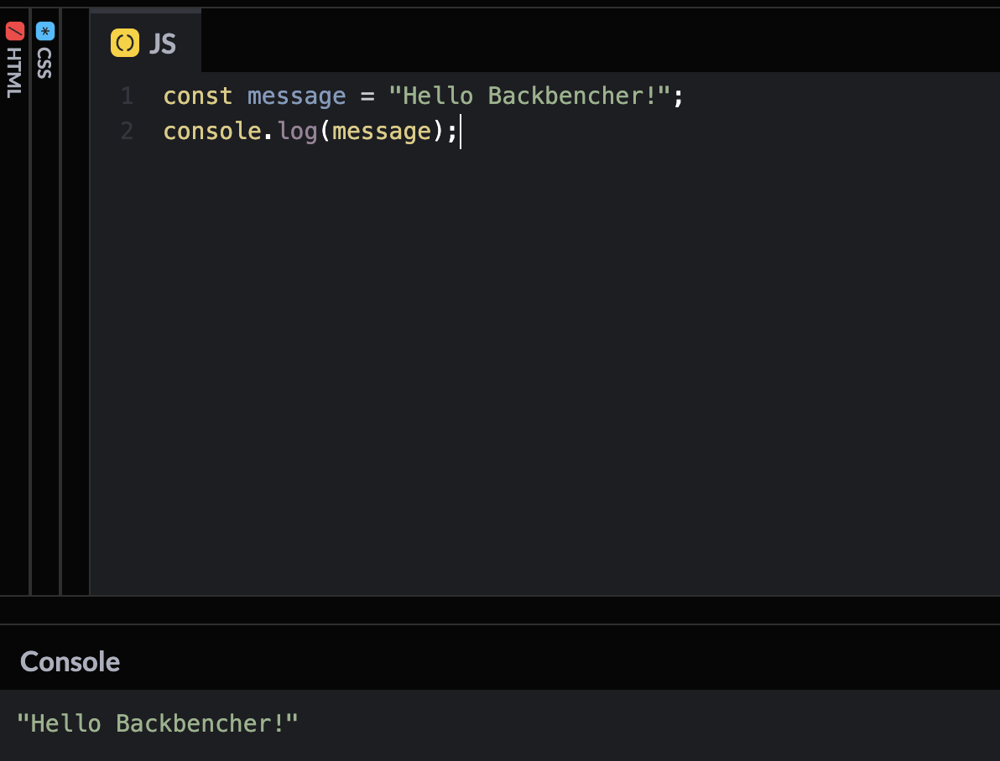
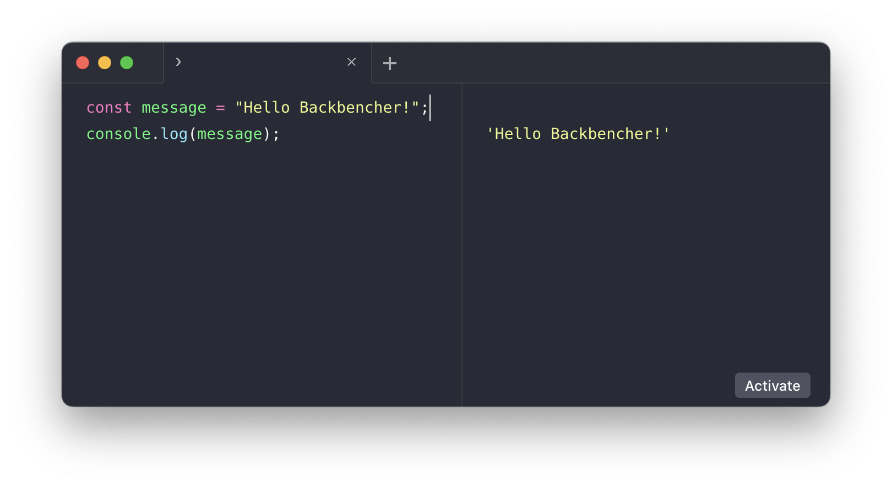

There are different ways to try JavaScript. In order to understand and run JavaScript code, we need a JavaScript compiler. Every browser available in the market has a JavaScript compiler or engine. We also have a standalone JavaScript run time, which is called **Node.js**.

## Testing Code

We are going to understand different ways using which we can run JavaScript and see the output. Here is the JavaScript code that we are going to try:

<!-- truncate -->

```javascript
const message = "Hello Backbencher!";
console.log(message);
```

`message` in the above code is a _variable_. Variables can store a value in JavaScript. In the second line, we print the value of the variable on screen.

## Running JavaScript in Browser Console

Browsers like Firefox, Chrome and Safari has a developer window. We can take the developer window by right clicking on the page and select _inspect_. We can try out javascript code in the browser _console_.



In browser environment, whenever JavaScript code makes a logging using `console.log()`, that is printed in this console.

We can also open the _console_ window using either of the following shortcuts:

1. By pressing **F12** key in keyboard
2. In windows, the shortcut key is _Ctrl+Shift+I_
3. In Mac, the shortcut key is _Cmd+Opt+I_

## Running JavaScript Using Node.js

Node.js is a server side Runtime engine for JavaScript. The core engine that runs Node.js is **V12**, which is the same engine that runs in Google Chrome.

In order to use Node.js, first you need to install Node.js from their [website](https://nodejs.org/).

After installation, we can verify if Node.js is installed properly by typing `node --version` command.



Once Node.js is installed, we can run JavaScript code using `node` command.

First step is to save our JavaScript code in a file. I created `test.js` and saved it in the desktop. Next, navigate to _Desktop_ in the terminal and run `node test.js`.



When running with Node.js, the `console.log()` statement prints the message directly in the terminal.

## Online Platforms

There are several online platforms available now to code. They not only provide a code editor, but also bring additional capabilities like pair programming and cloud storage. Here are few websites that allows JavaScript development and execution:

- [JSBin](https://jsbin.com/?js,console)
- [JSFiddle](https://jsfiddle.net/)
- [Codepen](https://codepen.io/)
- [CodeSandbox](https://codesandbox.io/)

In order to try our code, we can simply paste the code and run it. Here is a screenshot of Codepen tool.



## RunJS

[RunJS](https://runjs.app/) is an IDE that comes with a JS engine.
One can use it effectively to try JavaScript quickly and see the output.



If you need to save a file, we need to purchase the license.
