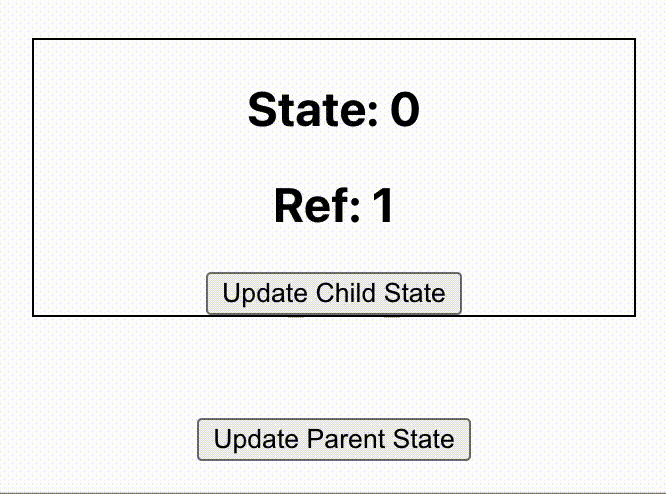

React is the preferred library in most of the web projects. Most of the projects which I come across follow either React directly or through some other flavors of React like _Next.js_ or _Gatsby_. Therefore, it is important to know different capabilities of React.

The questions and their solutions provided here are more realistic and practical. It is written from my experience of using React in my daily projects and taking several interviews for my company. I am not a supporter of asking tricky or difficult React questions that do not have much use or impact in actual project. I try to test if the candidate can use a feature in React in the most appropriate way. Sometimes, I twist the question little bit just to know if the candidate has actually good handson understanding or they have only theoritical understanding of the subject.

> This article is a work in progress. I am re-organizing the existing article and adding more questions in these days.

## Basics

This section covers basics of React. Most of the questions are suitable for a Junior React developer role. In addition to direct project related questions, we discuss about some concepts, mainly to check, how in-depth a candidate has tried to understand React.

**Question 1:**

What is virtual DOM? How virtual DOM boosts React performance?

**Answer:**

Like the actual DOM, the virtual DOM is a node tree that lists elements, their attributes and content as objects and properties. `render()` method in ReactDOM creates a node tree from React components and updates this tree in response to mutations in the data model caused by actions.

Whenever anything is changed, the entire UI is first re-rendered in virtual DOM representation. The difference between earlier virtual DOM representation and current one is calculated. The real DOM is updated with what has **actually changed**. **Updating virtual DOM is very fast compared to real browser re-render.** Hence performance is improved.

---

**Question 2:**

Is it possible to write a React application without JSX?

**Answer:**

Yes. It is possible.

In a React application, React components are created using `react.js` library. It is then rendered in a browser using `react-dom.js`. We can include both of these files directly from a CDN and use it.

```html
<script
  crossorigin
  src="https://unpkg.com/react@18/umd/react.development.js"
></script>
<script
  crossorigin
  src="https://unpkg.com/react-dom@18/umd/react-dom.development.js"
></script>
```

Here is an example of a React component that is written without JSX.

```javascript
const MyComponent = React.createElement("h1", null, "Hello World!");
ReactDOM.render(MyComponent, document.getElementById("root"));
```

`ReactDOM` is taken from `react-dom.js` library.

---

**Question 3:**

When we setup a React project, always we import two libraries, `react` and `react-dom`.

```javascript
import React from "react";
import ReactDOM from "react-dom";
```

If those two are used together always, why they are kept as two separate files?

**Answer:**

React library is used to create **components**. A component is a building block of an application. React library has classes and methods for this purpose.

On the other hand, React-DOM deals with **placing the components** on browser. It deals with shadow DOM and other efficient rendering techniques.

Now, if we consider React Native development, we again use React to build the app components. But we use React Native to build and publish the app for mobile devices.

We can see that React, as a component library is reused by several platforms like React Native, React 3D or React Art. That is why it is maintained as a separate project and package.

---

**Question 4:**

When I ran my React project, I am seeing this error in the browser console:

```
Warning: Each child in a list should have a unique "key" prop.
```

What might have happened?

**Answer:**

We receive this error when we try to render an array of components without a `key`. React recommends adding a unique `key` attribute to all the components that are rendered from an array.

```javascript
reactComponentsArray.map((Component) => <Component key={uniqueId} />);
```

React internally keeps track of components and their updates using this key. Without the key, each time, React needs to re-render the entire component list which affects the performance. That is why React alerts the developer during the development. This error message will not be displayed when using production build of React library.

---

**Question 5:**

What is JSX? and why do we use it in React project?

**Answer:**

JSX enables us to write React components using a syntax similar to HTML.

Here is a React component created **without** JSX:

```javascript
const Pet = (props) => {
  return React.createElement("div", {}, [
    React.createElement("h1", {}, props.name),
    React.createElement("h2", {}, props.animal),
    React.createElement("h2", {}, props.breed),
  ]);
};
```

Here is the same component written using JSX:

```javascript
const Pet = (props) => {
  return (
    <div>
      <h1>{props.name}</h1>
      <h2>{props.animal}</h2>
      <h2>{props.breed}</h2>
    </div>
  );
};
```

JSX adds the readability of the code.

---

**Question 6:**

Here is a JSX code snippet:

```html
<div>
  <h1>Hello JSX</h1>
  <h2 label="screen">Sub heading</h2>
</div>
```

Can you please write down JavaScript equivalent of this code?

> This question is to check if the candidate has heard about `React.createElement()`. Usually developers jump into a React project and start building components using JSX. Only a curious developer who went to know more about the under the hood details will answer this question. If a candidate answers this question, I will be more interested.

**Answer:**

JSX is a syntactical sugar for React developers to easily create components. We use transpilers like Babel to convert JSX to JavaScript.

When Babel converts above code to JavaScript, it makes use of `React.createElement()`. This method accepts 3 parameters.

1. Name of component
2. Attributes of the component
3. Children of the component

Here is how the JavaScript output of above code looks like:

```javascript
React.createElement("div", {}, [
  React.createElement("h1", {}, "Hello JSX"),
  React.createElement(
    "h2",
    {
      label: "screen",
    },
    "Sub heading",
  ),
]);
```

---

**Question 7:**

We have a functional component here:

```javascript
function Banner(props) {
  return <h1>{props.name}</h1>;
}
```

Convert above code to a class component.

**Answer:**

```javascript
class Banner extends React.Component {
  render() {
    return <h1>{this.props.name}</h1>;
  }
}
```

In functional components, we can give any name to the `props` argument. But in class component `props` are always taken from `this.props`.

---

**Question 8:**

Here is a React component that tries to display a variable:

```javascript
export default function App() {
  const website = "backbencher.dev"; // highlight-line
  return (
    <div className="App">
      <h1>Hello {website.toUpperCase()}</h1> //highlight-line
    </div>
  );
}
```

I am trying to print the website name in capital letters directly inside JSX. Will that work?

**Answer :**

Yes. We can write any valid expression inside the curly bracket. Therefore, in this case the output will be `"Hello BACKBENCHER.DEV"`.

---

**Question 9:**

Here we have got a React component. Inside the JSX, we invoke a function.

```javascript
//highlight-start
function capitalize(inputStr) {
  return inputStr.toUpperCase();
}
//highlight-end

export default function App() {
  const website = "backbencher.dev";
  return (
    <div className="App">
      <h1>Hello {capitalize(website)}</h1> // highlight-line
    </div>
  );
}
```

What will be the output? Will this code generate any error?

**Answer:**

This syntax is perfectly fine. Function invocation is a valid expression. The function is therefore invoked and the output printed will be `"Hello BACKBENCHER.DEV"`.

---

**Question 10:**

> This is a little advanced question. It requires good understanding of JSX.

What will be printed in the header?

```javascript
export default function App() {
  const a = <div id="backbencher" />;

  return (
    <div className="App">
      <h1>{a.props.id}</h1>
    </div>
  );
}
```

**Answer:**

The code displays `"backbencher"` inside `h1`.

Every JSX is converted to a JavaScript object during transpiling. For example `<div id="backbencher" />` is converted to below object.

```javascript
{
  type: "div",
  key: null,
  ref: null,
  props: {
    id: "backbencher"
  },
  // few more
}
```

That is why we could read the `props` property and display the value. Due to the same reason, we can use JSX in conditions, function argument or funtion return value. Basically we can use JSX in any place we can use an object.

---

**Question 11:**

I have two components `<WildAnimals />` and `<DomesticAnimals />`. If the value of `isWildAnimal` is `true`, I need to render `<WildAnimals />`. Or else, I need to render `<DomesticAnimals />`. In what all ways I can implement that in JSX?

**Answer: **

One way is to use `if..else`. When using `if..else`, the condition statement should be outside JSX because JSX can contain only expressions, not statements.

```javascript
let componentToRender = <DomesticAnimals />;
if (isWildAnimal) {
  componentToRender = <WildAnimals />;
}
```

Other technique is to use _ternary_ operator. Since using ternary operator is an expression, we can directly use inside JSX.

```javascript
<div className="App">
  {isWildAnimal ? <WildAnimals /> : <DomesticAnimals />}
</div>
```

---

**Question 12:**

We have a component `<WildAnimals />`. We need to show it only if `isWildAnimal` is `true`. How can we put that condition in JSX?

**Answer:**

One way is to use `if` condition. `if` condition needs to be outside JSX. So the code would look like:

```javascript
let wildAnimalComponent = null;
if (isWildAnimal) {
  wildAnimalComponent = <WildAnimals />;
}
return <div className="App">{wildAnimalComponent}</div>;
```

Another way is to use ternary operator:

```javascript
return <div className="App">{isWildAnimal ? <WildAnimals /> : null}</div>;
```

Last way and the normally used one in this case is to use logical AND operator. In JavaScript, in an `AND` operation, the operand that **decides the result of expression** is returned. Using that behaviour, we can write the JSX code as follows:

```javascript
return <div className="App">{isWildAnimal && <WildAnimals />}</div>;
```

---

**Question 13:**

Here we have a React component:

```javascript
<Banner>
  
  <caption>Good product</caption>
</Banner>
```

When the above component renders, it should render below HTML:

```html
<div class="banner">
  
  <caption>
    Good product
  </caption>
</div>
```

Please write down the code for `<Banner />` component.

**Answer:**

Here, we are passing the content for `Banner` component as `children`. Any content inside a component is passed to the component as `props`. We can retrieve the children from `props` using `props.children`. Here is the code for `Banner` component.

```javascript
function Banner({ children }) {
  return <div className="banner">{children}</div>;
}
```

---

## Hooks

**Question 14:**

What are hooks in React?

**Answer:**

Hooks was introduced in React v16.8. It allows to use all React features without writing class components. For example, before version 16.8, we needed a class component to manage state inside a component. Now we can keep state in a functional component using `useState()` hook.

---

**Question 15:**

Will React hooks work inside class components?

**Answer:**

No. Hooks will work only inside functional components.

---

**Question 16:**

Why React hooks was introduced?

**Answer:**

One reason to introduce hooks was the complexity in dealing with `this` keyword inside class components. If not handled properly, `this` will take some other value. That will result in breaking lines like `this.setState()` and other event handlers. Using hooks, we avoid that complexity when working with functional components.

Class components do not minify very well and also make hot reloading unreliable. That is another inspiration to bring hooks.

Another reason is that, there is no specific way to reuse stateful component logic. Even though HOC and render props patterns address this problem, that asks for modifying the class component code. Hooks allow to share stateful logic without changing the component hierarchy.

Fourth reason is, in a complex class component, related code are scattered in different lifecycle methods. Example, in case of a data fetching, we do that mainly in `componentDidMount()` and `componentDidUpdate()`. Another example is, in case of event listeners, we use `componentDidMount()` to bind an event and `componentWillUnmount()` to unbind. Hooks instead helps to place related code together.

---

### useState()

**Question 17:**

How `useState` hook works? What is/are the arguments accepted by this hook and what is returned by the hook?

**Answer:**

`useState` hook is a function which is used to store state value in a functional component. It accepts an argument as the initial value of the state. It returns an array with 2 elements. First element is the current value of state. Second element is a function to update the state.

We import `useState` first from React by

```javascript
import React, { useState } from "react";
```

Later we use `useState` like:

```javascript
const [currentStateValue, functionToUpdateState] = useState(initialStateValue);
```

---

**Question 18:**

Here we have a class component with a state value. Each time the button in component is clicked, the count is incremented.

```javascript
class Counter extends Component {
  state = {
    count: 0,
  };

  incrementCount = () => {
    this.setState({
      count: this.state.count + 1,
    });
  };

  render() {
    return (
      <div>
        <button onClick={this.incrementCount}>Count: {this.state.count}</button>
      </div>
    );
  }
}
```

Rewrite this component using React hooks.

**Answer:**

```javascript
import React, { useState } from "react";

function Counter() {
  const [count, setCount] = useState(0);

  return (
    <div>
      <button
        onClick={() => {
          setCount(count + 1);
        }}
      >
        Count: {count}
      </button>
    </div>
  );
}
```

---

**Question 19:**

Below we have a class component. It contains code to update the state based on previous state value.

```javascript
class Counter extends Component {
  state = {
    count: 0,
  };

  incrementCount = () => {
    this.setState((prevState) => {
      return {
        count: prevState.count + 1,
      };
    });
  };

  decrementCount = () => {
    this.setState((prevState) => {
      return {
        count: prevState.count - 1,
      };
    });
  };

  render() {
    return (
      <div>
        <strong>Count: {this.state.count}</strong>
        <button onClick={this.incrementCount}>Increment</button>
        <button onClick={this.decrementCount}>Decrement</button>
      </div>
    );
  }
}
```

Rewrite the above code using React hooks.

**Answer:**

One can update the value of a state variable just by passing the new value to update function or by passing a callback function. Second technique which accepts a callback function is safe to use.

```javascript
import React, { useState } from "react";

function Counter() {
  const [count, setCount] = useState(0);

  const incrementCount = () => {
    setCount((prevCount) => {
      return prevCount + 1;
    });
  };

  const decrementCount = () => {
    setCount((prevCount) => {
      return prevCount - 1;
    });
  };

  return (
    <div>
      <strong>Count: {count}</strong>
      <button onClick={incrementCount}>Increment</button>
      <button onClick={decrementCount}>Decrement</button>
    </div>
  );
}
```

---

**Question 20:**

Here we have class component that updates the state using the input from a form.

```javascript
export class Profile extends Component {
  state = {
    name: "Backbencher",
    age: 23,
  };

  onNameChange = (e) => {
    this.setState({
      name: e.target.value,
    });
  };

  onAgeChange = (e) => {
    this.setState({
      age: e.target.value,
    });
  };

  render() {
    return (
      <div>
        <form>
          <input
            type="text"
            value={this.state.name}
            onChange={this.onNameChange}
          />
          <input
            type="text"
            value={this.state.age}
            onChange={this.onAgeChange}
          />
          <h2>
            Name: {this.state.name}, Age: {this.state.age}
          </h2>
        </form>
      </div>
    );
  }
}
```

Rewrite the same component using React hooks.

**Answer:**

```javascript
import React, { useState } from "react";

function Profile() {
  const [profile, setProfile] = useState({
    name: "Backbencher",
    age: 24,
  });

  const onNameChange = (e) => {
    setProfile({ ...profile, name: e.target.value });
  };

  const onAgeChange = (e) => {
    setProfile({ ...profile, age: e.target.value });
  };

  return (
    <div>
      <form>
        <input type="text" value={profile.name} onChange={onNameChange} />
        <input type="text" value={profile.age} onChange={onAgeChange} />
        <h2>
          Name: {profile.name}, Age: {profile.age}
        </h2>
      </form>
    </div>
  );
}
```

The setter function of `useState()` does not automatically merge if an object is stored in state. But in case of `setState()` method in class components, auto merging happens.

Here we are merging object properties with the help of JavaScript spread operator.

---

**Question 21:**

What are the differences in using hooks and class components with respect to state management?

**Answer:**

When using `setState()` in class components, always the state variable is an object. Where as, the state variable in hooks can be of any type like number, string, boolean, object or array.

When state variable is an object, `setState()` in class components automatically merges the new value to the state object. But in case of setter function in `useState()`, we need to explicitly merge the updated object property using spread operator.

---

### useEffect()

**Question 22:**

What is the purpose of `useEffect` hook?

**Answer:**

The Effect hook lets us to perform side effects in functional components. It helps us to avoid redundant code in different lifecycle methods of a class component. It helps to group related code.

---

**Question 23:**

Here is a class component that prints _Boom_ in console whenever it is mounted or updated.

```javascript
export class Banner extends Component {
  state = {
    count: 0,
  };

  updateState = () => {
    this.setState({
      count: this.state.count + 1,
    });
  };

  componentDidMount() {
    console.log("Boom");
  }

  componentDidUpdate() {
    console.log("Boom");
  }

  render() {
    return (
      <div>
        <button onClick={this.updateState}>State: {this.state.count}</button>
      </div>
    );
  }
}
```

Remove the redundant console.log statement using React hooks.

**Answer:**

`componentDidMount()` and `componentDidUpdate()` are lifecycle methods. Such side effects can be done using `useEffect` hook. `useEffect` hook is a function which accepts a callback function. That callback function is called every time render happens.

The code can be rewritten as:

```javascript
import React, { useState, useEffect } from "react";

function Banner() {
  const [count, setCount] = useState(0);

  useEffect(() => {
    console.log("Boom");
  });

  const updateState = () => {
    setCount(count + 1);
  };

  return (
    <div>
      <button onClick={updateState}>State: {count}</button>
    </div>
  );
}
```

---

**Question 24:**

Understand the code below:

```javascript
function Banner() {
  const [count, setCount] = useState(0);
  const [name, setName] = useState("");

  useEffect(() => {
    console.log("Count is updated");
  });

  return (
    <div>
      <button onClick={() => setCount(count + 1)}>State: {count}</button>
      <input
        type="text"
        value={name}
        onChange={(e) => setName(e.target.value)}
      />
    </div>
  );
}
```

It logs "Count is updated" message even when updating the value in textbox. How can we show the log message only when the count state is updated?

**Answer:**

`useEffect` function accepts a second parameter which should be an array. Within this array, we need to pass the props or state we need to watch for. Only if those props or state mentioned in the array change, the effect is executed. So in our code, we add the second argument and specify only `count` value in the array.

Here is the udpated `useEffect` code:

```javascript
useEffect(() => {
  console.log("Count is updated");
}, [count]);
```

---

**Question 25:**

We have got a class component that updates time every second. It uses `componentDidMount()` to set the timer.

```javascript
export class Clock extends Component {
  state = {
    date: new Date(),
  };

  componentDidMount() {
    setInterval(() => {
      this.setState({
        date: new Date(),
      });
    }, 1000);
  }

  render() {
    return <div>{this.state.date.toString()}</div>;
  }
}
```

Convert the above code to React hooks.

**Answer:**

`componentDidMount()` is a lifecycle method that executes only once in a component lifecycle. We use `useEffect` to bring effects of `componentDidMount()`. But `useEffect` runs on every props or state updation. To prevent it, we make use of second array argument of `useState`. We keep that array empty. So for React, there are no props or state to watch for. Therefore `useEffect` runs only once like `componentDidMount()`.

Here is the code using React hooks.

```javascript
function Clock() {
  const [date, setDate] = useState(new Date());

  useEffect(() => {
    setInterval(() => {
      setDate(new Date());
    }, 1000);
  }, []);

  return <div>{date.toString()}</div>;
}
```

---

**Question 26:**

We have a code snippet from a class component which registers and remove an event listener.

```javascript
componentDidMount() {
  window.addEventListener("mousemove", this.handleMousePosition);
}

componentWillUnmount() {
  window.removeEventListener("mousemove", this.handleMousePosition);
}
```

Convert this code to React hooks format.

**Answer:**

```javascript
useEffect(() => {
  window.addEventListener("mousemove", handleMousePosition);

  return () => {
    window.removeEventListener("mousemove", handleMousePosition);
  };
}, []);
```

---

### useContext()

**Question 27:**

When should we use React Context instead of prop-drilling?

> _prop-drilling_ refers to the technique where we pass a value from one component to nested components through props.

**Answer:**

If we have a value that could be accessed anywhere from the application, we can consider **Context**. Few examples that fit to this condition is:

- Dark or light theme for a site
- Global site level theme settings
- User authentication status like is guest or is registered.

If the value shared by a component is specific to that component and its children, it is good to use prop-drilling. That improves code readability and the developer can easily identify from where this value is coming.

---

**Question 28:**

Here we have a set of 5 React components that is nested one inside other. Component `A` is passing a value to component `E` through prop-drilling.

```javascript
const E = (props) => <h1>{props.fruit}</h1>;
const D = (props) => <E fruit={props.fruit} />;
const C = (props) => <D fruit={props.fruit} />;
const B = (props) => <C fruit={props.fruit} />;
const A = (props) => <B fruit={props.fruit} />;

<A fruit="Apple" />;
```

How can we rewrite the same code using `useContext()`?

**Answer:**

```javascript
import React, { useContext } from "react";

const FruitContext = React.createContext();

const E = (props) => {
  const fruit = useContext(FruitContext);
  return <h1>{fruit}</h1>;
};

const D = (props) => <E />;
const C = (props) => <D />;
const B = (props) => <C />;

const A = (props) => (
  <FruitContext.Provider value="Apple">
    <B />
  </FruitContext.Provider>
);

export default A;
```

---

### useRef()

**Question 29:**

What is the common application of `useRef()` hook? Explain the implementation.

**Answer:**

Normally we use `useRef()` to hold reference to any DOM element. In order to use it, first we need to import `useRef()` hook from `react` package.

```javascript
import { useRef } from "react";
```

Next we create a reference object inside the component by invoking `useRef()` hook.

```javascript
const divRef = useRef();
```

Now we can attach the ref variable `divRef` to any DOM element using the `ref` attribute. Here is a code snippet that changes the background color of a `div` element when user clicks on the `div` block.

```javascript
import { useRef } from "react";

export default function DOM() {
  const divRef = useRef();

  const clickHandler = () => {
    divRef.current.style.backgroundColor = "red";
  };

  return (
    <div ref={divRef} onClick={clickHandler}>
      Try Clicking Me!
    </div>
  );
}
```

---

**Question 30:**

Other than accessing DOM elements using `ref` attribute, is there any other use for `useRef()`?

**Answer:**

Accessing DOM elements using `ref` attribute is just one of the use case of `useRef()`. Basically, `useRef()` is like a box that can hold a mutable value in its `.current` property.

Here we have a parent component that can update its state:

```javascript
export default function Parent() {
  const [stars, setStars] = useState("");

  const clickHandler = () => {
    setStars(stars + "*");
  };

  return (
    <>
      <Child />
      <button onClick={clickHandler}>Update Parent State</button>
    </>
  );
}
```

The `Child` component contains a ref object which increments its current value on each render.

```javascript
export default function Child() {
  const [count, setCount] = useState(0);

  const refCount = useRef(0);
  refCount.current++;

  const updateCount = () => {
    setCount(count + 1);
  };

  return (
    <div
      style={{ border: "1px solid #000", width: "300px", margin: "50px auto" }}
    >
      <h2>State: {count}</h2>
      <h2>Ref: {refCount.current}</h2>
      <button onClick={updateCount}>Update Child State</button>
    </div>
  );
}
```

Each time when the `Child` component is rendered, we can see the ref count getting incremented without getting resetting to 0. Here is a GIF image that shows the output.



The double rendering on each button click is due to React running in development mode.

## Performance

**Question 31:**

How to measure performance of a React application?

**Answer:**

One way to measure the performance of a React component is by using **Profiler**.

---

## Tools

**Question 32:**

For a React project, will you choose Webpack or Parcel?

**Answer:**

Webpack and Parcel are two tools to bundle files in a React project. We are trying to compare both of them and make better decisions in our React project.

> For busy readers, if you are building a big React project or needs to suggest a bundler for an upcoming big project, Webpack is the choice.

**Zero Configuration**

The main highlight of **Parcel** bundler is that we can start using Parcel just like that. No configurations are required. But, from Webpack 5 onwards, we can use Webpack also with zero configuration.

Typically there will be a `webpack.config.js` Webpack config file in a project. In some projects, there will be multiple config files. Then, based on the environment, we take different type of builds.

So regarding configuration, both are good and easy to start. But as more and more customiztion is required in the bundle, we need to go with Webpack.

**Code-Splitting**

Both performs code splitting. But, Parcel throws out all the output files to a single folder. So sometimes the output folder is a big mess of CSS, JS and html files.

On the other hand, we can tell Webpack to group CSS, JS, Images or HTML to separate folders and keep the project more structured.

**Bundling Speed**

Parcel is slow for the first build. Then it picks up.

Webpack takes more time based on the configurations we write.

Both tools support live hot reload in their own way.

**Community Support**

That is everything for a serious project. If something goes wrong, there should be a strong community to support. Webpack is a clear winner there.

If you are looking for a Webpack plugin, 99% it will be there. Sometimes more than one will be available. You just have to pick the one with more stars.

Parcel is a great starter for development, teaching or proof of concepts. In the long run, everyone needs Webpack.

---

**Question 33:**

You are going to initialize your React project as a Git repository. What all files or folders you usually add to your `.gitignore` file?

**Answer:**

Files or folders added in `.gitignore` file are avoided by Git while tracking. For a typical React project we add following files or folders in `.gitignore`.

**node_modules**

Like any other Node projects, we ignore `node_modules/` directory. Including `node_modules` directory increases the project size to a large extend. Other than the size, it is always good to install the packages from `package.json` if a new developer is cloning the project.

**coverage**

When we implement code coverage in our project, all the reports are stored in `coverage/` folder. We do not want that to be uploaded to Git server.

**DS_Store**

Mac OS creates this file in every folder if we open that folder in `Finder`. DS_Store stands for Desktop Services Store. The file basically stores information about the current folder and other files around it. It does not have any signifance specific to our React project.

**Distribution**

`dist/` is the name of a typical directory used to store distribution files. That is the common naming convention. If your project has another name for output folder, give that name in `.gitignore`.

**IDE Specific**

If we are working in Visual Studio Code, it automatically creates a `.vscode` directory to store the project settings. Other editors like _Sublime Text_ has its own versions of settings file. We can exclude those files or directories from versioning.

**Logs**

Any logs or directories that contains just log information can be ignored. That folder will keep on getting larger and its totally unnecesary to include it in versioning.

Here is an example `.gitignore` file.

```
.idea/
.vscode/
node_modules/
build
.DS_Store
*.tgz
my-app*
template/src/__tests__/__snapshots__/
lerna-debug.log
npm-debug.log*
yarn-debug.log*
yarn-error.log*
/.changelog
.npm/
```

Other informations we might add to `.gitignore` are changelogs, snapshots or build zip files.

---

**Question 34:**

Which of the following `import` techniques is better for performance and why?

```javascript
// Method 1
import Lodash from "lodash";
// Method 2
import { capitalize } from "lodash";
```

**Answer:**

In a JavaScript or Node.js project, we can `import` modules using different ways. Here are two examples which we discuss today.

```javascript
// Default import
import Lodash from "lodash";
Lodash.capitalize("hello");

// Named import
import { capitalize } from "lodash";
capitalize("hello");
```

Lodash is just an example used to demonstrate the performance. We all know that lodash contains several utility methods.

Both the types of `import` works. But the performance of both techniques vary based on the bundler we use. Different bundlers use the different ways for **tree shaking**.

> Tree shaking is the process taken by bundlers to find out what all methods or modules need to be included in the output bundle.

It is always advised to use **named imports**. It makes sure that only the required modules are loaded to the output bundle.
