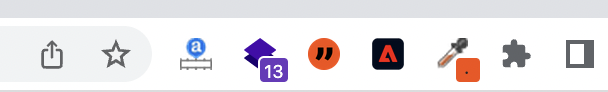
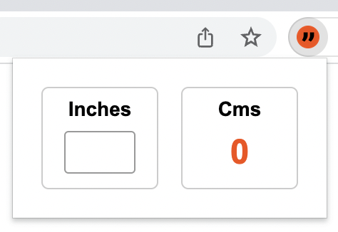
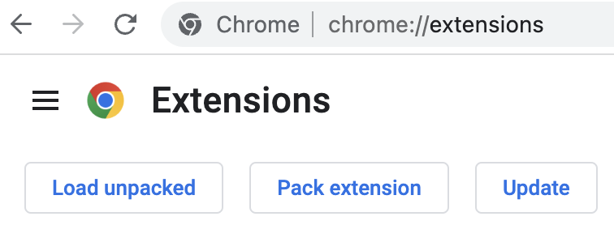
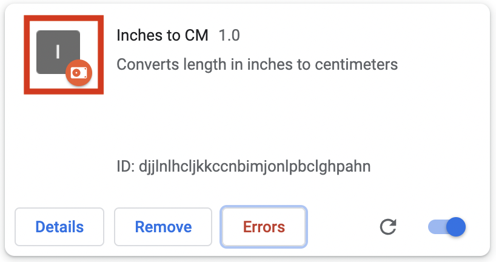
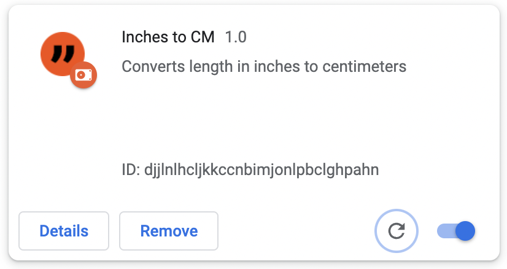
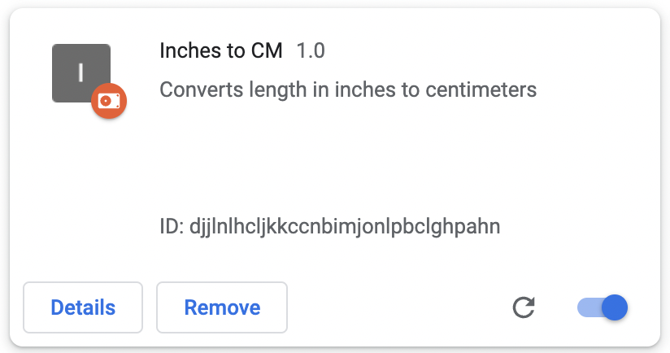
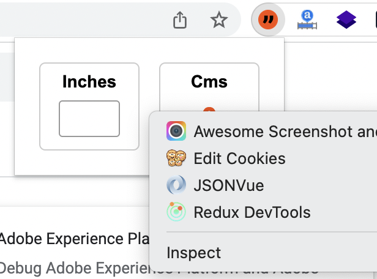
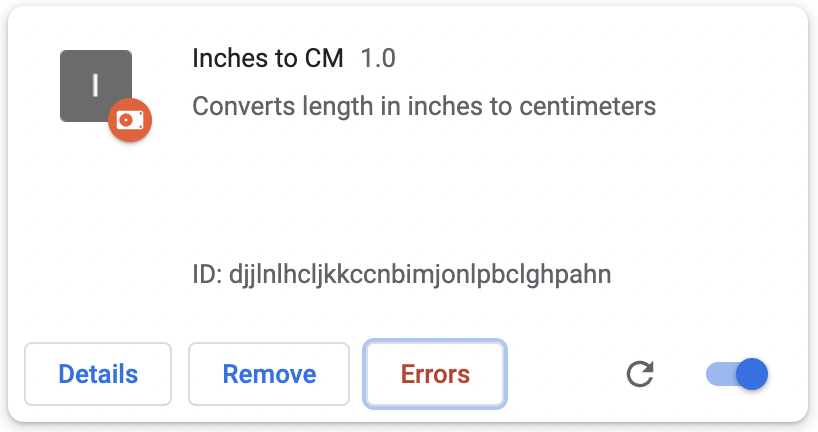
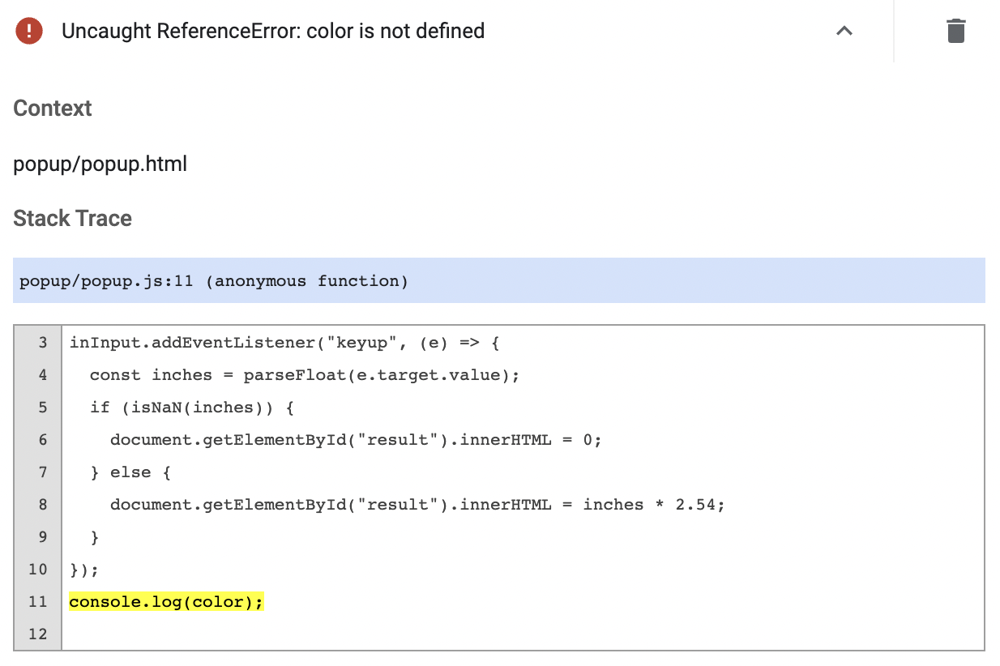

Google Chrome extension is a piece of code that adds the capabilities of Google Chrome browser. Some of the popular examples of Google Chrome extensions are:

- [Wappalyzer](https://chrome.google.com/webstore/detail/wappalyzer-technology-pro/gppongmhjkpfnbhagpmjfkannfbllamg): Finds out the libraries and frameworks used in a website
- [Awesome Screenshot](https://chrome.google.com/webstore/detail/awesome-screenshot-and-sc/nlipoenfbbikpbjkfpfillcgkoblgpmj): Take and share webpage screenshots
- [WhatFont](https://chrome.google.com/webstore/detail/whatfont/jabopobgcpjmedljpbcaablpmlmfcogm?hl=en): Easily identify the fonts used in a website
- [Cookie Editor](https://chrome.google.com/webstore/detail/cookie-editor/iphcomljdfghbkdcfndaijbokpgddeno): Edit web page cookies easily, especially for testing purpose
- [JSONVue](https://chrome.google.com/webstore/detail/jsonvue/chklaanhfefbnpoihckbnefhakgolnmc): Automatically formats JSON response

<!-- truncate -->

## Skills Required

Chrome extension is created using the same technologies for web development. Therefore, we need to have basic knowledge on:

- HTML
- CSS
- JavaScript

## Inches to Centimeters Extension

It is always fun to learn a particular technology as part of a project. So, we are going to create a Google Chrome extension that helps users to convert inches to centimeters easily. By the time we complete this project, we will learn:

- Setting up folder structure
- Create `manifest.json` file
- Set extension icon
- Design and style popup using HTML and CSS
- Manifest icons
- Bring some logic using JavaScript
- Loading the extension in Chrome browser
- Debugging using `console.log()`
- Reloading the extension after an update
- View errors thrown by the extension

Here is the [link](https://github.com/backbenchercode/Inches-to-Centimeters-Chrome-Extension) to completed project in Github. At any time you can compare the code to verify or download the assets as you wish.

### Setup Folder Structure

In order to start developing a Chrome extension, we first need to create a folder to store all the extension files. The folder can be created anywhere in our machine. My folder name is `inches-to-centimeters`.

### manifest.json

`manifest.json` file is mandatory in all extensions. When an extension is loaded to Google Chrome, Chrome looks for this file. If `manifest.json` file is not there in the extension folder, Chrome does not consider the folder as an extension.

Create a `manifest.json` file directly inside your newly created extension folder. I created mine at `inches-to-centimeters/manifest.json`. Then copy the below contents to the file.

```json
{
  "manifest_version": 3,
  "name": "Inches to CM",
  "description": "Converts length in inches to centimeters",
  "version": "1.0.0",
  "action": {
    "default_popup": "popup/popup.html",
    "default_icon": "logo.png"
  }
}
```

The properties used in `manifest.json` are defined by Google. Each property has got a special meaning.

1. `manifest_version` is set as `3`. This version refers to the version of manifest file to be considered while parsing. The properties and values used in version 2 is different from that of version 3.
2. `name` refers to the name of the extension. This name is used by Chrome in extensions page, web store and other places.
3. `description` property takes a basic description of the extension.
4. `version` refers to the version of the extension itself. If we add any features or fix any issues, we update the version number. It will then be updated across all the users.
5. `action` contains an object. The value of `default_popup` is a path to an HTML file. This file is rendered as the extension popup. Also, `default_icon` holds the image that represents the extension in Chrome browser.

We will be adding one more property `icons`, in the `manifest.json` later in this article. It specifies the icons used by Chrome extensions page and Google web store.

### Extension Icon

Every extension we install comes with an icon. We can see the list of icons on top of Google Chrome browser.



We are going to set an icon for our extension also. We already specified in `manifest.json` that our `default_icon` is `logo.png`. Therefore, we need to save our icon image as `logo.png` in the project root folder.

Our extension logo looks like this:


You can download the logo image from this [link](https://github.com/backbenchercode/Inches-to-Centimeters-Chrome-Extension/raw/main/logo.png). Just save it in your project root folder. That is it.

### Design and Style Popup

We can see all extensions showing some content when we click on the extension icon. In our case, this is how the popup looks like:



This popup design is coming from `popup/popup.html` which we mentioned earlier inside `manifest.json` file. For that matter, create a `popup.html` under `popup` folder. Paste the below HTML code into it:

```html
<!DOCTYPE html>
<html lang="en">
  <head>
    <meta charset="UTF-8" />
    <link href="popup.css" rel="stylesheet" />
    <title>Popup</title>
  </head>
  <body>
    <div class="form-container">
      <div>
        <div class="title">Inches</div>
        <input type="text" id="inches-input" maxlength="2" />
      </div>
      <div>
        <div class="title">Cms</div>
        <div id="result">0</div>
      </div>
    </div>
  </body>
</html>
```

The HTML code contains mainly a form container that holds a textbox to accept inches and a result section that shows the output in centimeters.

In line number 5, we are adding reference to a css file. So, next step is to create this `popup.css` file under `popup` folder. The HTML and CSS file are in the same level. Then paste below styles to `popup.css` file.

```css
html,
body {
  margin: 0;
  padding: 0;
}

.form-container {
  display: flex;
  font-family: Arial, Helvetica, sans-serif;
  font-size: 14px;
  width: 180px;
  justify-content: space-between;
  padding: 20px;
}

.form-container > div {
  border: 1px solid #ccc;
  border-radius: 5px;
  flex: 0 0 80px;
  text-align: center;
}

.title {
  font-weight: bold;
  line-height: 30px;
}

#inches-input {
  width: 50px;
  height: 30px;
  text-align: center;
  border: 1px solid #999;
  border-radius: 3px;
  box-sizing: border-box;
  padding: 10px;
  margin: 0px auto 10px auto;
  font-size: 16px;
  font-weight: bold;
  outline: none;
}

#result {
  line-height: 30px;
  font-size: 24px;
  font-weight: bold;
  color: #f84c03;
}
```

### Loading Extension to Chrome

Now that we have built a nice popup. We would like to see it working. Normally, we install extensions from Google web store. But our extension has not reached the web store. It is still in our machine.

We can load locally stored extensions in Chrome. For that first, visit `chrome://extensions` in Chrome browser.



Click on the `Load unpacked` button. Select the `inches-to-centimeters` folder. If you have given another name, select that folder.

We can see our extension loaded, just like any other extensions.

### Manifest Icons

Right now, when we go to the extensions page, we can see our extension there. But, there is no icon for the extension.



In order to bring the extension icon here, we need to add `icons` property in `manifest.json` file. For that open `manifest.json` file and add below properties.

```json
"icons": {
    "16": "icons/icon16.png",
    "32": "icons/icon32.png",
    "48": "icons/icon48.png",
    "128": "icons/icon128.png"
  },
```

Above key-value pairs tell Chrome, where to look for icons of different size. We now need to create an `icons` folder and place 4 icons in it. You can download the icons from below links:

- [icon16](https://raw.githubusercontent.com/backbenchercode/Inches-to-Centimeters-Chrome-Extension/main/icons/icon16.png)
- [icon32](https://raw.githubusercontent.com/backbenchercode/Inches-to-Centimeters-Chrome-Extension/main/icons/icon32.png)
- [icon48](https://raw.githubusercontent.com/backbenchercode/Inches-to-Centimeters-Chrome-Extension/main/icons/icon48.png)
- [icon128](https://raw.githubusercontent.com/backbenchercode/Inches-to-Centimeters-Chrome-Extension/main/icons/icon128.png)

After placing the icons, if we reload the extension, we can see the icon in the tile.



### Adding Logic Using JavaScript

Just like any web page, we can add JavaScript to `popup.html`. For that, first create `popup.js` under `popup` folder. Add the script reference just before closing `<body>` tag inside `popup.html`.

```html
<!DOCTYPE html>
<html lang="en">
    <!-- ... -->
    <script src="popup.js"></script>
  </body>
</html>
```

Copy the below contents to `popup.js`.

```javascript
const inInput = document.getElementById("inches-input");
inInput.addEventListener("keyup", (e) => {
  const inches = parseFloat(e.target.value);
  if (isNaN(inches)) {
    document.getElementById("result").innerHTML = 0;
  } else {
    document.getElementById("result").innerHTML = inches * 2.54;
  }
});
```

Above scripts will take the value of textbox as we type and writes the centimeter value in the result section.

## Reload Updated Extension

Now that we updated the extension code. We added JavaScript also to our extension. The already loaded extension in Google Chrome, will not automatically update to reflect the code change. We need to manually do the update.

For that, Go to the extension tile in `chrome://extensions` page.



Click on the refresh icon in the tile. That will reload the extension with updated code.

## Debugging Using Console Logs

In JavaScript, we can log messages using `console.log()`. We can make use of the same method to print messages in console.

> Always keep in mind that extensions run in a separate context than the current web page.

Let us add a `console.log()` in `popup.js`. Add below line on the top of `popup.js`.

```javascript
console.log("I am loaded from extension");
```

Save the file and reload the extension.

In order to see the logged message, we need to right click on top of the extension popup and then view the console.



A new window will popup. There we can see the message logged.

## Viewing Errors

In order to view error, let us make an error in `popup.js`. We are going to use a variable `color` which is not declared. That will throw a reference error.

```javascript
console.log(color);
```

Add above line as the last line of `popup.js`; Now reload the extension. We can see a new button called `Errors` in the extesion tile.



If we click on the button, we can see the details of the error.



The line that throws the error is highlighted in yellow.

## Summary

We learned how to setup a basic extension, style it and add some logic using JavaScript. We also learned how to debug using `console.log()` and extension error window.
