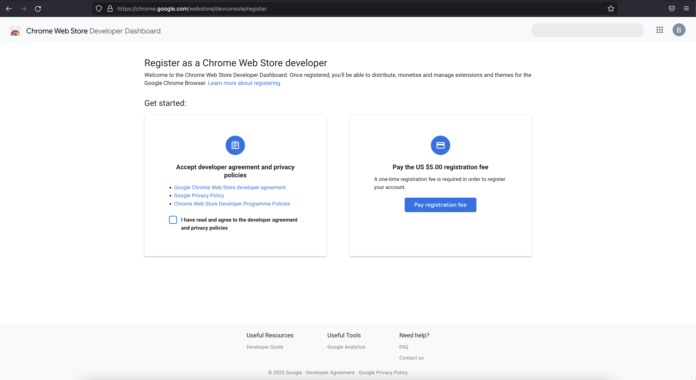
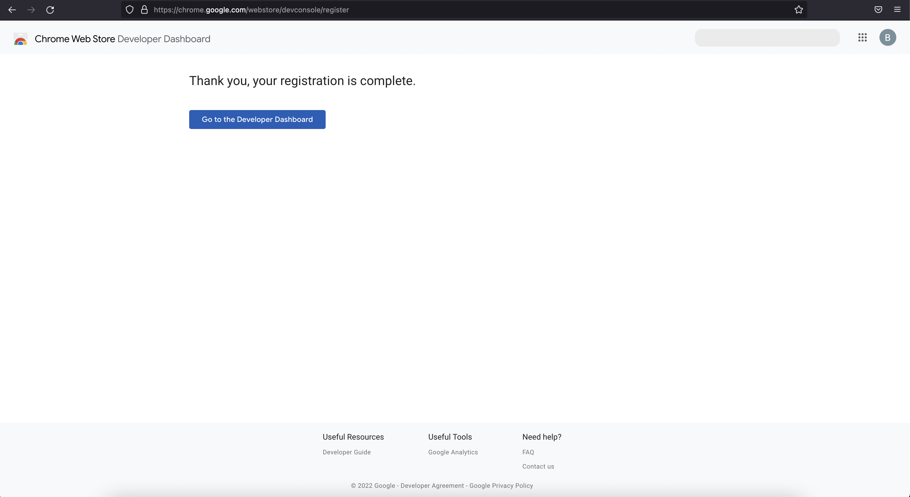
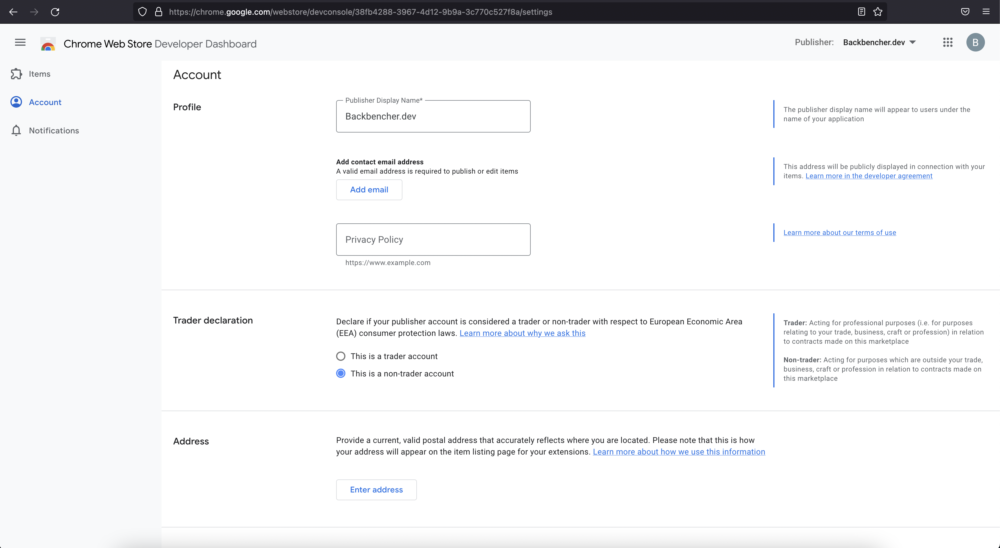
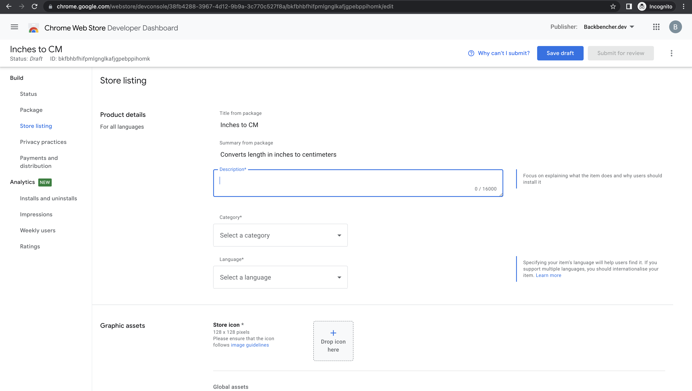
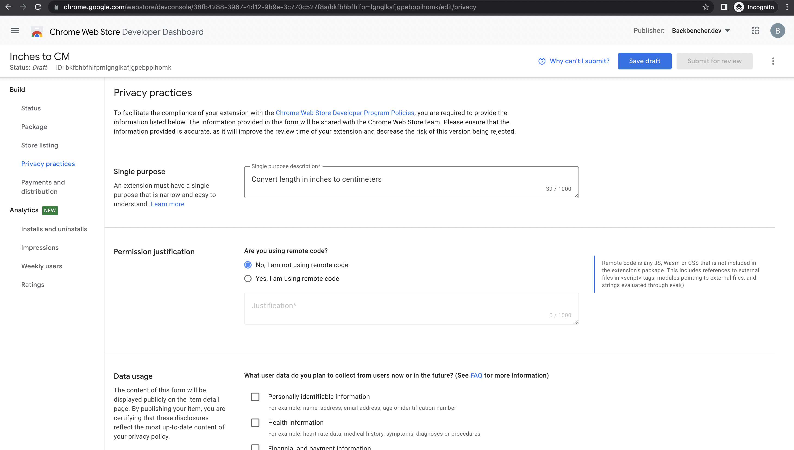
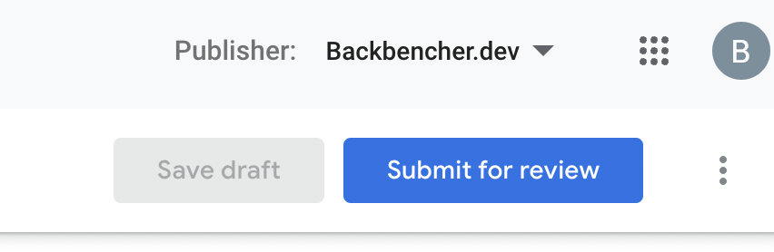
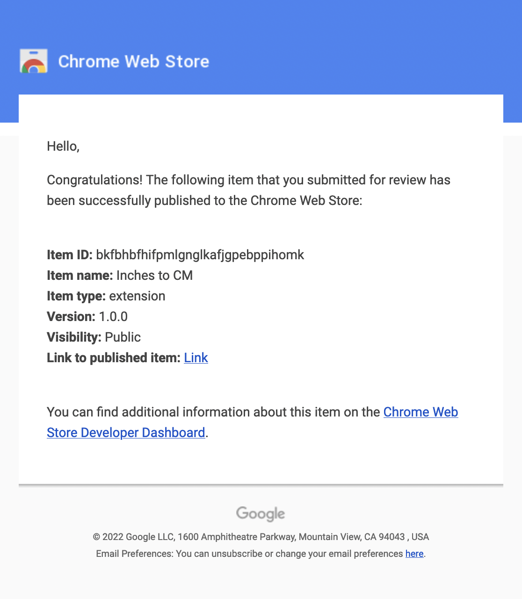
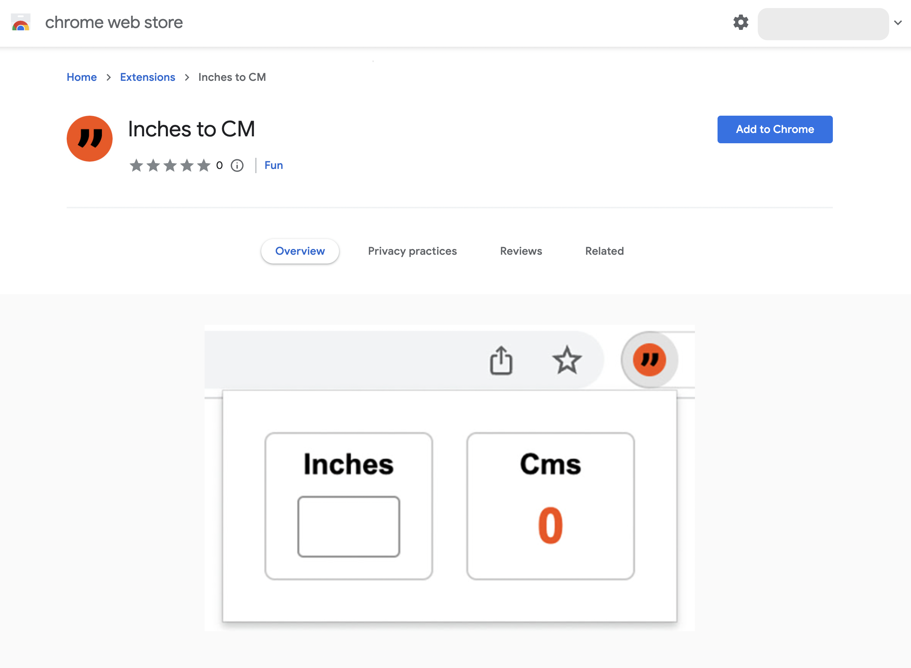

[Google web store](https://chrome.google.com/webstore/category/extensions) is the marketplace for Chrome extensions. We can search for extensions in the web store. We can also install extensions in our Chrome browser directly from the store. This article explains how to publish our own extension to Google web store.

We are going to publish the Chrome extension we created as part of [Introduction to Google Chrome Extension Development](/blog/introduction-google-chrome-extension-development). You can also download the extension code from [Github](https://github.com/backbenchercode/Inches-to-Centimeters-Chrome-Extension).

<!-- truncate -->

This article purely focuses on publishing an extension. It does not cover creating an extension. You can check [Introduction to Google Chrome Extension Development](/blog/introduction-google-chrome-extension-development) to learn how to start with extension development.

## Prepare Extension

In order to publish an extension, the `manifest.json` should have following properties:

- `name`
- `version`
- `icons`
- `description`

After doing the above checking, zip the entire extension folder. I have created `Inches-to-Centimeters-Chrome-Extension-main.zip` file in my laptop.

## Setup Developer Account

Create a **new gmail account** just to manage the chrome extensions. It is also suggested by Google.

After creating the new gmail account, go to [https://chrome.google.com/webstore/devconsole](https://chrome.google.com/webstore/devconsole). If you are not logged in, it will prompt you to login.

Once you are signed in, the first step to register is agree to web store terms and conditions.

Then click the payment button and pay the one time $5 registration fee. After successful payment, you will see below screen:

Click on _Go To Developer Dashboard_. There you can provide your details in the account info.

Following fields are mandatory:

- **Publisher Display Name**
- **Contact email address**: This email will be displayed under your item's contact information. After adding your email address, you need to verify it.
- **Privacy Policy**: You can upload the privacy policy text in your website and provide the link here.

Save changes after updating above details.

## Upload Extension

Now that we have provided all necessary account information. We can go to [Google Developer Dashboard](https://chrome.google.com/webstore/devconsole) to upload our extension.

Click on **New Item** button. Follow the instructions to upload your zip file.

> In my case Google was throwing error while uploading. For me uploading worked only when I enabled 2-factor authentication for my developer account.

If everything went well, Google reads the information in our extension manifest file and show us a page like below:

Fill all the required and optional fields you like. For **Store Icon**, we can provide the same icon used in the extension of size 128x128.

For screenshot, you can take the screenshot of your extension and make it to a proper size. I took mine and cropped it to 640x400 using photoshop.

After filling all the details in the page, save the changes.

Then move to _Privacy Practices_ page. Fill out the single purpose and permission justification. Then save the changes.

After completing above steps, we can see the **Submit For Review** button enabled.

Click the review button. Click ok in the subsequent confirmation windows.

The extension is now submitted for review.

## Review and Publishing

If the permissions requested are less, the approval will be faster. My extension did not have any permission requests. It got approved in 2 days. Once the extension is approved, we will receive a mail like below:

We can view our published extension by clicking the link in the mail.

Good luck with publishing your extension!
