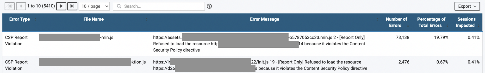

CSP stands for Content Security Policy. It is an added layer of security in browsers. Bluetriangle can detect and report those errors.

CSP helps to detect and avoid certain types of attacks like Cross-Site Scripting and data injection attacks. These types of attacks are used for data thefts, site defacement and malware distribution.

<!-- truncate -->

## How CSP Errors are reported in BlueTriangle

CSP violation errors in BlueTriangle are reported as below:

It shows which scripts are violating the policy by loading other scripts.

If you see `[Report Only]` as shown in the image, then the CSP is not actually implemented. The scripts that violates are also loaded in the browser. It is up to you to take action or not.

## How CSP is implemented on a site

You can first get a report of scripts that violate CSP using `Content-Security-Policy-Report-Only` header.

In order to actually blocking the violating scripts, use `Content-Security-Policy` header.

Read more on CSP here: https://developer.mozilla.org/en-US/docs/Web/HTTP/CSP
