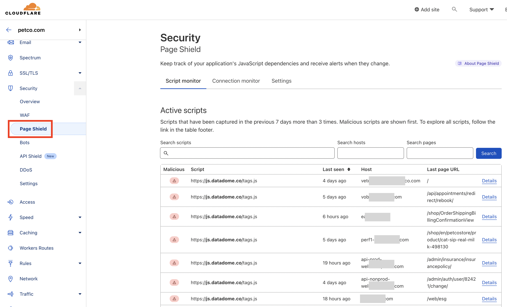

When Page Shield is enabled in Cloudflare, CloudFlare automatically adds `Content-Security-Policy-Report-Only` header to all the pages.

```
content-security-policy-report-only: script-src 'none'; report-uri https://csp-reporting.cloudflare.com/cdn-cgi/...
```

<!-- truncate -->

Basically it means that if there is any CSP violation occurrence, it is reported to CloudFlare. And in CloudFlare, we can see the report.



In order to view the report:

- Login to cloudflare
- Go to **Security** menu
- Under that, click on **Page Shield**

There you can see all the scripts and the violations made by them.
