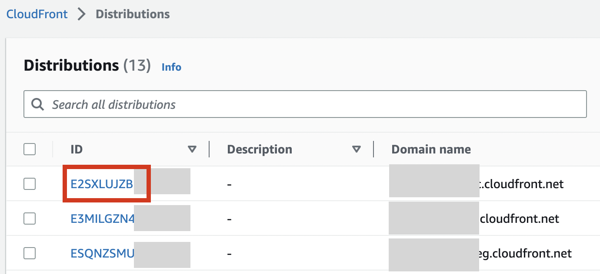
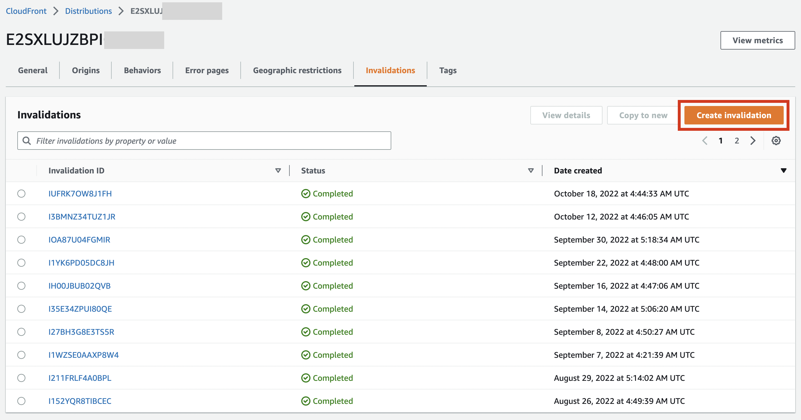
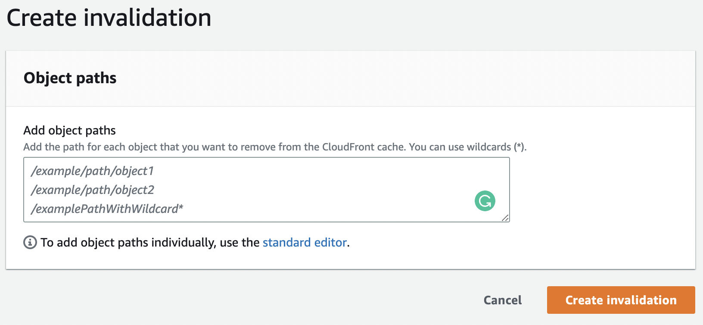

First, Click on the Cloudfront ID for which you want to clear the cache.

<!-- truncate -->

In the Cloudfront Id details page, click on **Invalidations** tab. There you can see all invalidations done so far. Invalidations means clearing cache.

In order to clear cache, click on "Create Invalidation" button.

In the textarea, you can provide the url patterns to clear the full cache or a portion of cache. When you click on the orange _Create Invalidation_ button, you can see a loader loading for some time and then show _Complete_. At that time you can ensure that the cache is cleared.
