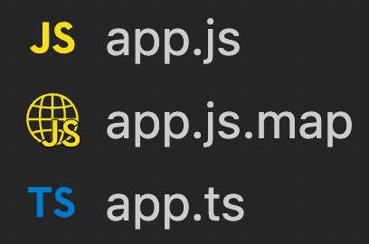
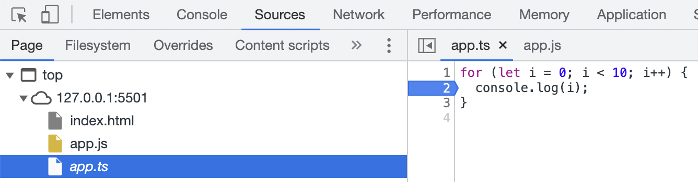

When `tsconfig.json` file is generated, it contains a commented line for sourcemap. In order to enable source maps in a TypeScript project, we need to uncomment the line.

```json
{
  "compilerOptions": {
    //...
    "sourceMap": true
  }
}
```

<!-- truncate -->

After enabling `sourceMap`, when we run `tsc` command, along with `.js` file, we can also see `.js.map` file generated.



This map file brings the original TypeScript file in the browser `sources` tab. It helps us to debug easily by directly viewing the TypeScript files.



We can also place breakpoints in the TypeScript files.
