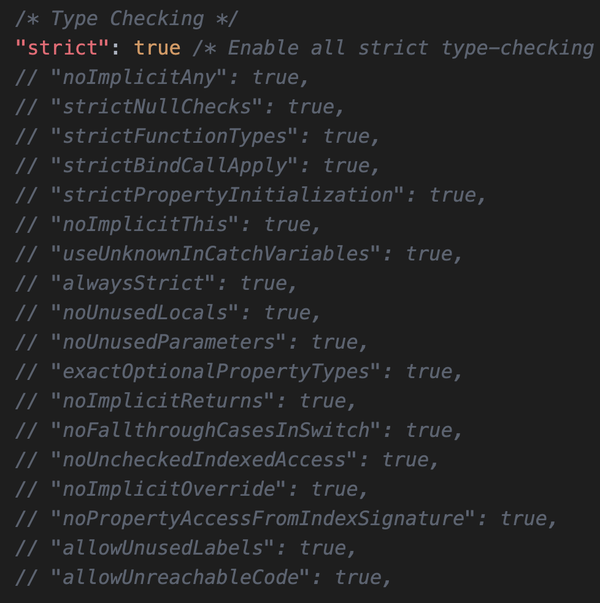

If strict compilation is enabled in TypeScript, TypeScript will be more strict in checking certain rules. Strict mode is enabled by default. It can be found under `compilerOptions` in `tsconfig.json`.

<!-- truncate -->

The _Type Checking_ section has the `strict` property set as `true`. That is kind of enabling all the strict properties in one go.

If you want to enable some strict properties and disable others, you can comment the global `strict` property and go with individual settings below.
