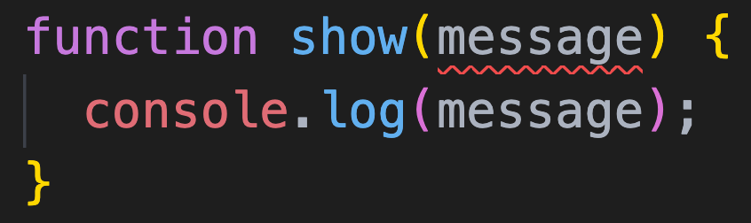
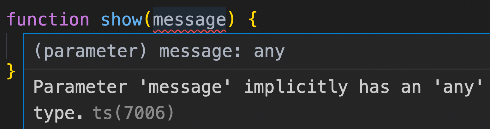

`noImplicitAny` is an option under `compilerOptions` in `tsconfig.json`.

In order to understand the meaning of `noImplicitAny` option, consider the following TypeScript code. I have taken screenshot from VS Code to show the highlighted red error.

<!-- truncate -->

The type of `message` is not specified. That will give `any` type to `message`. The error is because `noImplicitAny` value is `true`. Here is the error displayed by TypeScript:

When we set `noImplicitAny` to `false`, TypeScript will allow implicit `any` type.

> When I tried in VS code, it did not remove the error. But tsc compiler respects this option.
