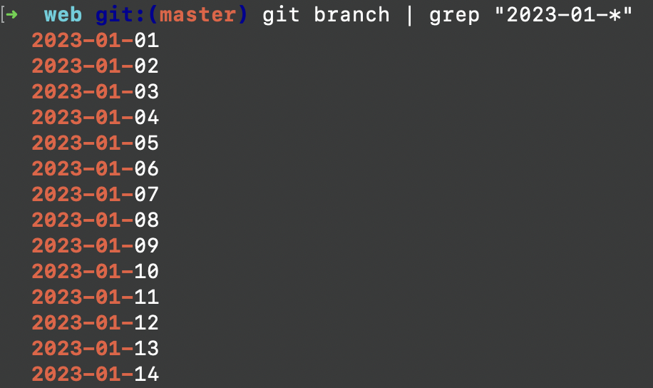

I try to write one article for each day. When I get time, I write articles for future dates also. I then keep each future articles in their own branch names like `2023-02-04`, `2023-02-05`. On the day of publishing, I merge the corresponding branch to `master` branch.

<!-- truncate -->

Now, once January is over, I had to delete all branches starting with `2023-01`. Here is how I did it.

First select the correct branch names using `grep`.

```
git branch | grep "2023-01-*"
```

Above command lists out all branch names starting with `2023-01-` as shown below.



We then pipe the output to `git branch -D` command to delete each branch names. So, this is the full command which selects the branch names and deletes it, in one step.

```
git branch | grep "2023-01-*" | xargs git branch -D
```
