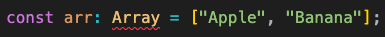

Generics allows us to provide types to other types. Oh wow? It went above my head :)

Let us try to understand from an example.

<!-- truncate -->


Here is a code that declares an array of strings.

```typescript
const arr: string[] = ["Apple", "Banana"];
```

Now an array of strings can be declared in a different way. Do you know that, TypeScript contains an `Array` type to declare arrays? Lets try that.



Did you notice the red error line below `Array`? So what is the issue here?

`Array` is a **generic** type. That means, when we use `Array` type, we also need to tell if it is going to contain a string, number or whatever type we wish. And this is how we provide it.

```typescript
const arr: Array<string> = ["Apple", "Banana"];
```

If we want an array that can have either string or number, this is how we do it.

```typescript
const arr: Array<string | number> = ["Apple", "Banana", 12, 78];
```
