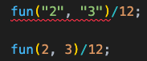

We can create a generic function in TypeScript. That means, it will be a function that takes the argument and return type dynamically.

To understand better, here we have a normal typed function:

<!-- truncate -->

```typescript
function fun(a: number, b: number): number {
  return a;
}
```

`fun()` function takes 2 numbers and returns a number.

Next, we need to make use of `add()` function to also return a string. For that we need to update the argument and return type as shown below:

```typescript
function fun(a: number | string, b: number | string): number | string {
  return a;
}
```

But, when we write a function like above, the inputs can be a string and return can be a number.

How can we make it like, if the input is _number_ type, return also should be _number_ type. Same thing for _string_? For that, we can use generics.

```typescript
function fun<T>(a: T, b: T): T {
  return a;
}
```

Now the type of function `fun()` is decided based on the type of argument passed to the function. Because of that you can see below that the first function invocation throws error, as division on strings are not allowed.


