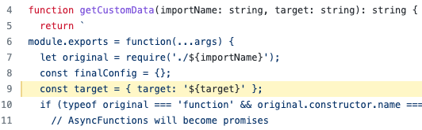

If you are here, then you might be trying to deploy Next.js v13 to AWS using @sls-next component. As of now, the @sls-next component does not support Next.js v13.

@sls-next component is adding `target: "serverless"` configuration dynamically to next.config.js. Here is the code that is doing it, [link](https://github.com/serverless-nextjs/serverless-next.js/blob/master/packages/libs/core/src/build/lib/createServerlessConfig.ts#L9):

Many suggests to use `output` configuration instead. But, `output` does not work exactly like `target`.

I was trying to explain the reason behind the error. Hope, I could throw some light.
